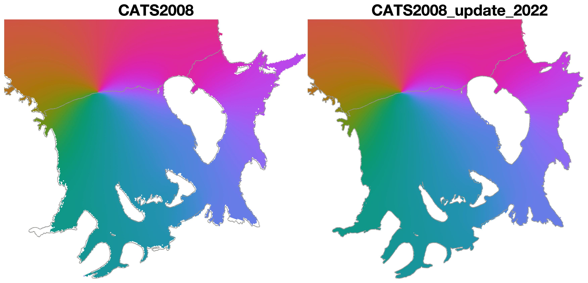

# 🚧 Tide Model Driver 3.0 🚧 
Tide Model Driver for MATLAB, version 3.0

🚧 This repo is construction. 🚧


# What's new in TMD 3.0?


* Switched to consolidated NetCDF model data format. 
* TMD functions rewritten for improved performance. 
* Improved documentation.  
* CATS2008 updates: 
	* CATS resolution increased from 4 km to 2 km. 
	* CATS bathymetry and coastlines adjusted to match BedMachine v2 ([Morlighem et al., 2020](https://doi.org/10.1038/s41561-019-0510-8)). 
	* Ice shelf flexure model included for tidal deflections in grounding zones. 

# Contents 
### Help 
To access TMD documentation within MATLAB, simply type 

```matlab
tmd
```
into the Command Window. To access documentation for a specific function, type `tmd` followed by the function name into the Command Window. For example:

```matlab
tmd tmd_predict
```
### Main Function
Most users will only need to interact with one function. It is: 

* `tmd_predict` predicts tidal elevation, transport, or current velocities for given location(s) and time(s). 

### Other helpful functions

* `tmd_interp` provides water column thickness, land/ocean mask, ice shelf flexure, and tidal constiuent parameters at specified geographic locations, for a given tide model. 
* `tmd_data` loads gridded tide model data without interpolation. 

### Under-the-hood functions 
You probably won't need to call any of the following functions directly, but they called by the functions above. 

* `tmd_astrol` 
* `tmd_constit`
* `tmd_harp`
* `tmd_InferMinor`
* `tmd_nodal`

### Conversion from OTIS to NetCDF format

This version of TMD works with NetCDF data, which have been converted from the original OTIS format using the `tide-model-conversions` folder. 

# Installation 
1. Get tide model data. 
2. Install TMD 

# Author Info & Citation Information