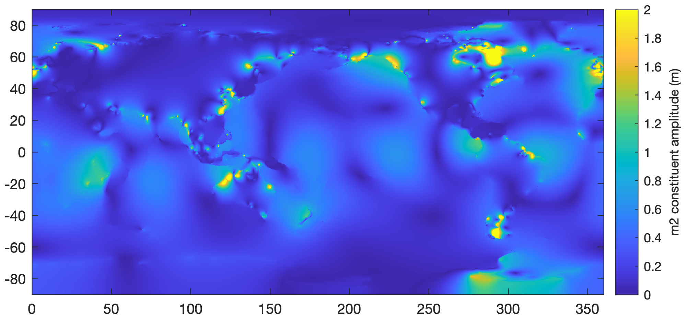
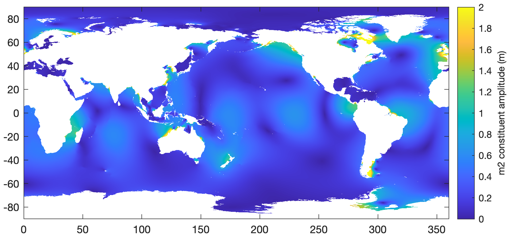

[&larr; Back to TMD3.0 Main Page](../README.md)

# TMD3.0 Model File Format
TMD3.0 introduces a new, consolidated NetCDF data format for global and regional tide models. The new, consolidated NetCDF format:

* Reduces complexity by placing all of the model constituents of the `h`, `U`, and `V` coefficients into a single data file, without the need for any extra grid files; 
* Is easier to work with than the old binary format; 
* Significantly reduces total model file size by taking advantage of data compression;
* Includes metadata such as units, grid information, map projection parameters, version information, and author attribution. 
* Variables `U` and `V` are now interpolated to the `h` nodes, meaning transport data is no longer offset by half a pixel from the grid. 

This page describes the consolidated NetCDF data format for TMD3.0 compatible tide model files. 

## Explore file contents 
Take a look inside any TMD3.0 compatible NetCDF, and the contents should be fairly straightforward. Here's an example: 

```matlab
>> ncdisp('TPXO9_atlas_v5.nc')
Source:
           /Users/cgreene/Documents/data/tides/TPXO9_atlas_v5.nc
Format:
           netcdf4_classic
Global Attributes:
           Conventions       = 'CF-1.7'
           Title             = 'TPXO9_atlas_v5'
           Description       = 'Global tide model at 1/30 degree resolution.'
           Author            = 'Egbert, Gary D., and Svetlana Y. Erofeeva.'
           creation_date     = '2023-04-15'
           tmd_version       = 3
           NetCDF_conversion = 'Chad A. Greene'
           model_type        = 'ocean'
           license           = 'ask'
           Data_citation     = 'Egbert, Gary D., and Svetlana Y. Erofeeva. "Efficient inverse modeling of barotropic ocean tides." Journal of Atmospheric and Oceanic Technology 19.2 (2002): 183-204.'
Dimensions:
           lon          = 10802
           lat          = 5401
           constituents = 15
Variables:
    mapping     
           Size:       1x1
           Dimensions: 
           Datatype:   char
           Attributes:
                       grid_mapping_name = 'latitude_longitude'
                       epsg_code         = 4326
                       spatial_proj4     = '+proj=longlat +ellps=WGS84 +datum=WGS84 +no_defs'
    lon         
           Size:       10802x1
           Dimensions: lon
           Datatype:   single
           Attributes:
                       standard_name = 'longitude'
                       long_name     = 'grid cell center longitude (first and last columns are repeats, to enable seamless interpolation)'
                       units         = 'degrees'
    lat         
           Size:       5401x1
           Dimensions: lat
           Datatype:   single
           Attributes:
                       standard_name = 'latitude'
                       long_name     = 'grid cell center latitude'
                       units         = 'degrees'
    constituents
           Size:       15x1
           Dimensions: constituents
           Datatype:   int8
           Attributes:
                       standard_name     = 'tidal_constituents'
                       long_name         = 'Tidal constituents listed in order in the constituent_order attribute.'
                       constituent_order = '2n2 k1 k2 m2 m4 mf mm mn4 ms4 n2 o1 p1 q1 s1 s2'
    amplitude   
           Size:       15x1
           Dimensions: constituents
           Datatype:   double
           Attributes:
                       standard_name = 'amplitude'
                       long_name     = 'amplitude of equilibrium tide in m for each tidal constituent.'
                       units         = 'meters'
    phase       
           Size:       15x1
           Dimensions: constituents
           Datatype:   double
           Attributes:
                       standard_name = 'phase'
                       long_name     = 'Astronomical arguments (relative to t0 = 1 Jan 0:00 1992)'
                       units         = 'radians'
    omega       
           Size:       15x1
           Dimensions: constituents
           Datatype:   single
           Attributes:
                       standard_name = 'omega'
                       long_name     = 'frequency'
                       units         = '1/s'
    alpha       
           Size:       15x1
           Dimensions: constituents
           Datatype:   single
           Attributes:
                       standard_name = 'alpha'
                       long_name     = 'loading love number'
    hRe         
           Size:       10802x5401x15
           Dimensions: lon,lat,constituents
           Datatype:   int16
           Attributes:
                       standard_name = 'height_coefficient'
                       long_name     = 'real component of height constituent'
                       grid_mapping  = 'polar_stereographic'
                       units         = 'm'
                       scale_factor  = 0.00030746
    hIm         
           Size:       10802x5401x15
           Dimensions: lon,lat,constituents
           Datatype:   int16
           Attributes:
                       standard_name = 'height_coefficient'
                       long_name     = 'imaginary component of height constituent'
                       grid_mapping  = 'polar_stereographic'
                       units         = 'm'
                       scale_factor  = 0.00030746
    URe         
           Size:       10802x5401x15
           Dimensions: lon,lat,constituents
           Datatype:   int16
           Attributes:
                       standard_name = 'transport_coefficient'
                       long_name     = 'real component of U transport constituent. This is the zonal (east-west) flow component in geographic coordinates.'
                       grid_mapping  = 'polar_stereographic'
                       units         = 'm^2/s'
                       scale_factor  = 0.015712
    UIm         
           Size:       10802x5401x15
           Dimensions: lon,lat,constituents
           Datatype:   int16
           Attributes:
                       standard_name = 'transport_coefficient'
                       long_name     = 'imaginary component of U transport constituent. This is the zonal (east-west) flow component in geographic coordinates.'
                       grid_mapping  = 'polar_stereographic'
                       units         = 'm^2/s'
                       scale_factor  = 0.015712
    VRe         
           Size:       10802x5401x15
           Dimensions: lon,lat,constituents
           Datatype:   int16
           Attributes:
                       standard_name = 'transport_coefficient'
                       long_name     = 'real component of V transport constituent. This is the meridional (north-south) flow component in geographic coordinates.'
                       grid_mapping  = 'polar_stereographic'
                       units         = 'm^2/s'
                       scale_factor  = 0.015712
    VIm         
           Size:       10802x5401x15
           Dimensions: lon,lat,constituents
           Datatype:   int16
           Attributes:
                       standard_name = 'transport_coefficient'
                       long_name     = 'imaginary component of V transport constituent. This is the meridional (north-south) flow component in geographic coordinates.'
                       grid_mapping  = 'polar_stereographic'
                       units         = 'm^2/s'
                       scale_factor  = 0.015712
    wct         
           Size:       10802x5401
           Dimensions: lon,lat
           Datatype:   int16
           Attributes:
                       standard_name = 'wct'
                       long_name     = 'water column thickness'
                       units         = 'meters'
                       grid_mapping  = 'polar_stereographic'
    mask        
           Size:       10802x5401
           Dimensions: lon,lat
           Datatype:   int8
           Attributes:
                       standard_name = 'ocean_mask'
                       long_name     = 'ocean mask'
                       grid_mapping  = 'polar_stereographic'
                       valid_range   = [0  1]
                       flag_values   = [0  1]
                       flag_meanings = 'land ocean'
```

The attributes above should be pretty straightforward, but I'll point out that the `model_type` can either be `'ocean'` or `'load'`. 

## Global models vs regional models 
All model files are either *global* or *regional*. Global models, like the one above, are presented on a regular grid in geographic coordinates (degrees) and have 1D `lon` and `lat` variables. For global models, longitude is treated like the x dimension, and latitude is treated like the y dimension.

Regional models (CATS, Arctic models, etc) can be on regular geographic grids, but are often presented on grids that are regular in *projected* coordinates, meaning they are spaced equally in meters or kilometers. The proj4 string in the NetCDF file describes the projection parameters for any regional model. Regional models also include MxN arrays of latitude and longitude values. 

In both global and regional models, all coordinates correspond to grid cell centers. 

Most TMD functions accept latitude and longitude as inputs, and automatically project them to regional model coordinates where necessary.

## Constituents 
The tidal constituents are easy to miss in the NetCDF. They appear as a simple string, in the `constituent_order` attribute of the `constituents` variable. Here's how to access them: 

```matlab
>> ncreadatt('TPXO9_atlas_v5.nc','constituents','constituent_order')
ans =
    '2n2 k1 k2 m2 m4 mf mm mn4 ms4 n2 o1 p1 q1 s1 s2'
```

Constituents can also be accessed as cell arrays using the
[`tmd_conlist`](tmd_conlist_documentation.md) function: 

```matlab
>> cons = tmd_conlist('TPXO9_atlas_v5.nc')
cons =
  1×15 cell array
  Columns 1 through 12
    {'2n2'}    {'k1'}    {'k2'}    {'m2'}    {'m4'}    {'mf'}    {'mm'}    {'mn4'}    {'ms4'}    {'n2'}    {'o1'}    {'p1'}
  Columns 13 through 15
    {'q1'}    {'s1'}    {'s2'}
```

I realize this is a somewhat strange way to package the constituent names, but it's the simplest way I could figure out how to do it, given the limitations of the NetCDF format. 

## Real and Imaginary Components 
For tidal height h, zonal transport U, and meridional transport V, you'll find real and imaginary components hRe, hIm, URe, UIm, VRe, and VIm in the model file. The complex constituent can then be constucted following the format 

```matlab
hc = complex(hRe,hIm); 
```

or 

```matlab
hc = hRe + 1i*hIm; 
```
and the amplitude is then 

```matlab
hAm = abs(hc); 
```
and the phase is given by 

```matlab
hPh = angle(hc); 
```
Note: Some conventions use the complex conjugate of `hc`, and calculate
phase angle as `atan2(-imag(h), real(h))`, but TMD3.0 uses a convention
that matches MATLAB's built-in `complex` and `angle` functions.

## U and V variables
Each tide model file contains real and imaginary components of U and V
transport variables, whose units are m^2 /s. 

Regardless of whether the model is global or regional, U and V always
correspond to zonal (positive pointing geographic east) and meridional
(positive pointing geographic north) components of transport. 

Transport estimates are usually pretty good, and represent column-averaged 
(barotropic) flow. Column-averaged velocities are obtained by dividing
transport by water column thickness, so the accuracy of velocity
estimates is subject to the accuracy of the bathymetry estimate. 

TMD3.0 model file format does not account for vertical variations in
tidal transport or current velocity. In other words, this is a strictly
barotropic model, and does not attempt to represent baroclinic flow. 

**Important:** Previous versions of TMD interpreted U and V on staggered grids, in which each variable would be interpolated at a location offset by half a pixel. In the new, consolidated NetCDF format, all variables are centered on their respective coordinates. 

## Units 
TMD3.0 uses meters, seconds, and combinations of meters and seconds. Previous versions of TMD produced tidal currents in cm/s, but we now package transports in units of m^2 /s, so they may easily be divided by water column thickness (m), to get velocities of m/s. 

## Masks 
TMD does something new with masking: The scripts that create each model file use `regionfill` to interpolate values of tidal constituents across all land areas. 

Here's what the m2 constituent amplitude looks like in the TPXO9 file:

```matlab
[ph,lon,lat] = tmd_data('TPXO9_atlas_v5.nc','hAm','constituents','m2'); 

figure
h=imagesc(lon,lat,ph);
axis xy image 
caxis([0 2])
cb = colorbar; 
ylabel(cb,'m2 constituent amplitude (m)') 
```
<p align="center"></p>

*Why on Earth would we say there's a finite, nonzero tidal amplitude in
the middle of China, or any other landmass?* Well, the reason's quite simple: 
Sometimes you may be interested in tides that are close to shore, for example, 
if you have a tide gauge at the end of a dock that may lie between
modeled ocean and land pixels. In such a case, you know that tides exist
there, but the tide model would only produce NaNs. You could extrapolate
from the nearest grid cell that produces a finite tide solution, but that'd 
be inelegant and almost certainly wrong. The `regionfill` approach
produces smoother, more physical interpolation close to the coast and is
a reasonable approximation where the underlying tide model cannot offer a
solution. 

Note that we only fill the landmasses for tidal heights (h; not U or V), because tidal height predictions should be reasonable in a narrow, tidal inland creek that the mask identifies as land, whereas inland transport values would depend on geometry that was not represented in the model. 

The [`tmd_interp`](tmd_interp_documentation.md) function sets land areas 
to NaN by default (but offers an option to "unmask"). For your tidal needs, 
you may wish to mask out land areas using the `mask` variable, which is
1 for all ocean grid cells, and 0 everywhe else. Below I'm using the mask
to set the transparency of the previous image: 

```matlab
[mask,lon,lat] = tmd_data('TPXO9_atlas_v5.nc','mask'); 
h.AlphaData = mask; 
```

<p align="center"></p>

## Amplitude, phase, alpha, and omega 
In each TMD3.0 compatible model file, you will find variables called
amplitude, phase, omega, and alpha. You probably won't need to interact
with these variables directly, but they are from the `tmd_constit`
function. 

## `scale_factor` 
The real and imaginary components of h, U, and V are all scaled by a
strange number listed as the `scale_factor` of each variable. MATLAB
automatically parses the `scale_factor` when reading in the variables, so
you don't have to worry about multiplying anything by anything. 

*Why isn't the scale factor a simple round number?* Because it doesn't
have to be. Again, you don't have to worry about the `scale_factor`. The
value of the scale factor is chosen to take advantage of the full range
of the int16 Datatype that it's saved as. Any other scale factor would
either clip the large values, or digitize the data at lower precision
than necessary. 

## Extra columns in global models 
You may notice that global model files have an extra grid cell on each end,
corresponding to an extra longitude step before 0 and after 360. This
rationale is that interpolation near 0 degrees longitude would produce
NaNs, and you'd end up with a seam of missing data at that lontitude. 

The trick of repeating a few rows or columns around the 0 degree longitude
is an old one, and it could be performed after loading the data, rather than 
saving the data. However, `tmd_interp` only loads pixels around query
points, so the simplest solution is to repeat the data in the data file,
rather than writing `tmd_interp` to call `tmd_data` multiple times and
stitch the pieces together before interpolation. 

## Ice Shelf Flexure 
For the CATS model, we have added a `flexure` variable. This is a
first-order estimate of tidal flexure of ice shelves in the grounding
zone, generated by appling a simple 1D linear elastic model to BedMachine
v3 ice thickness, assuming an elastic modulus of E=4.8 GPa and Poisson's ratio
nu=0.4. Values range from zero to about 100, corresponding to the
percent of tidal range that the ice shelf should exhibit. Values can
exceed 100 by a few percent near the hydrostatic line. 

## MATLAB scripts to write consolidated NetCDFs
The MATLAB scripts we used to convert tide models from the original binary OTIS format to the new, consolidated NetCDF can found in the `tide-model-conversions` folder of this GitHub repo. 

## Author Info
This document was written by [Chad A. Greene](https://www.chadagreene.com), June 2022. 