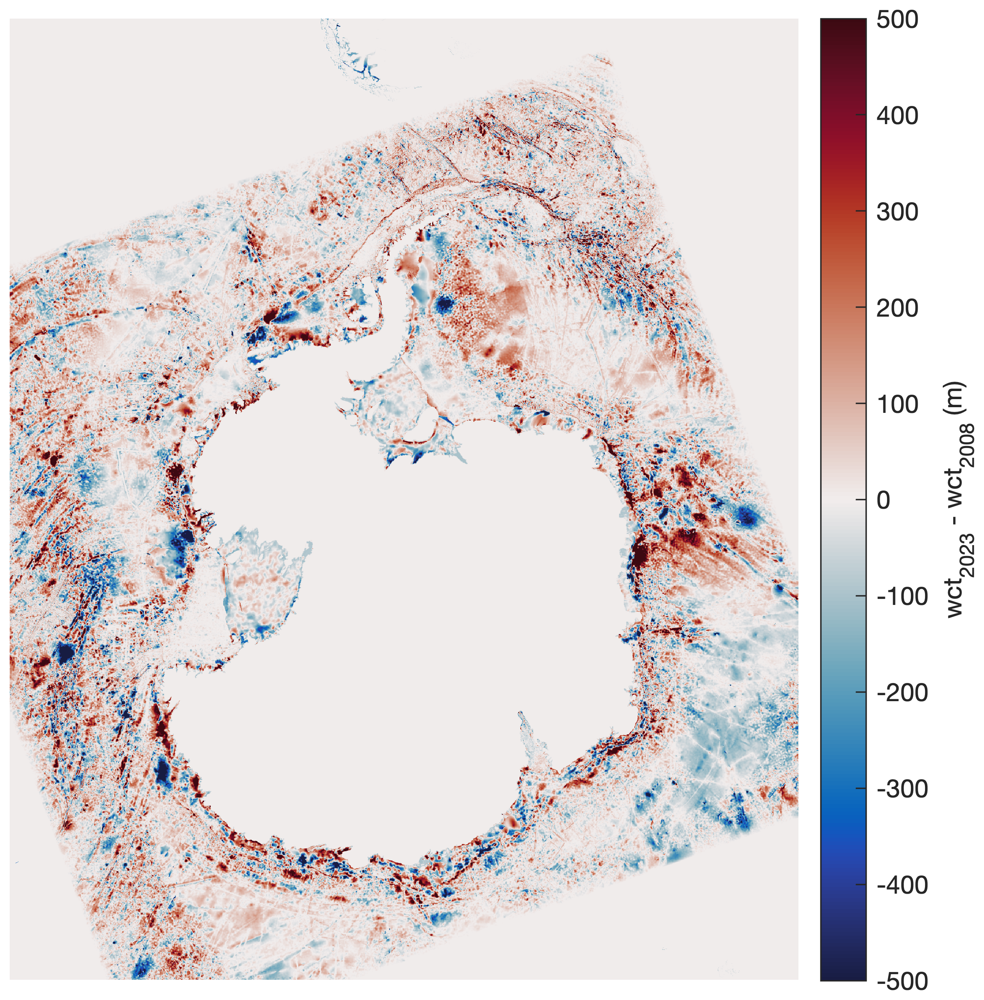

[&larr; Back to TMD3.0 Main Page](../README.md)

# CATS2008 updates in 2023

In 2023, the Tide Model Driver for MATLAB v2.5 was rewritten and released as Tide Model Driver for MATLAB v3.0, or TMD3.0. With the updates came the opportunity to make adjustments to the CATS2008 model that has served us so well. The updates to the CATS2008 model include:

* Grid node spacing is now 2 km (was previously 4 km). The CATS2008 model was interpolated to the finer grid to provide a better representation of coastlines and ice shelf grounding lines. 
* Coastlines have been adjusted to match BedMachine v3 ([Morlighem et al., 2020](https://doi.org/10.1038/s41561-019-0510-8)). The image at the top of this page (m2 constituent tidal phase) illustrates the adjustments made to the Filchner-Ronne ice shelf, whose grounding line now closely matches the BedMachine v2 grounding line. Areas that were previously grounded and had no tidal constituent data in CATS2008 have been filled using MATLAB's `regionfill` function, applied to the real and imaginary components of tidal constituents individually. An ocean mask matching BedMachine v3 is provided in the model file to mask out grounded areas.
* Water column thickness was adjusted to match BedMachine v3. A diff map appears below. 
* Ice shelf `flexure` model included for tidal deflections in grounding zones. Flexure is approximated by a forward 1d linear elastic model applied to BedMachine v3 ice geometry, with elastic modulus E=4.8GPa and Poisson's ratio nu=0.4.

The MATLAB script used to convert the old CATS2008 binary files into the new, updated, consolidated NetCDF format is called `CATS_to_NetCDF.m`, and can be found in the `tide-model-conversions` folder of this GitHub repository. 

# Author Info
TMD3.0, the updates to CATS2008, and this documentation page were written by [Chad A. Greene](https://www.chadagreene.com), June 2022, updated February 2023. 