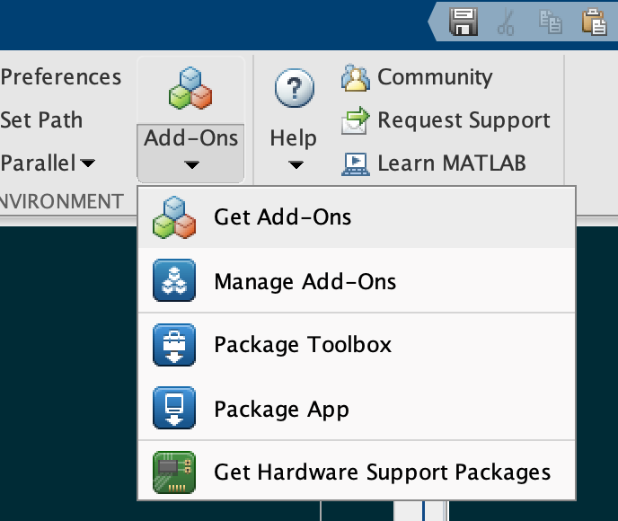

[&larr; Back to TMD3.0 Main Page](../README.md)

# Installing TMD3.0 
Installing TMD3.0 is pretty straightforward. There are a few ways you can do it, but here's the easiest: 

## Option 1: From the MATLAB Add-Ons Menu
If you're signed in with a MathWorks account, just click **Add-Ons** &rarr; **Get Add-Ons** from the MATLAB Home menu. Here's what it looks like: 

<p align="center"></p>

After clicking **Get Add-Ons**, search for "Tide Model Driver", then click **Add to MATLAB**. That's it. You should be good to go. 

## Option 2: Download the files
Depending on how you interact with GitHub, you may have downloaded the TMD3.0 files directly, or you may have them in a local folder on your computer. If either of these apply to you, I recommend adding a [`startup.m`](https://www.mathworks.com/help/matlab/ref/startup.html) file to your MATLAB home directory, which runs every time MATLAB starts. 

Inside `startup.m`, include a line that adds the path to your TMD3.0 folder, let's assume you've called it `TMD_functions`. Use `genpath()` to add all the folders within folders. You may also want to add a path to wherever you have placed your tide model data. The lines you'll put in your `startup.m` should look something like: 

```matlab
% On my computer I have one directory for TMD functions...
addpath(genpath('/Users/cgreene/Documents/TMD_functions'))

% ...and another directory where I keep the model data: 
addpath(genpath('/Users/cgreene/Documents/TideModelData'))
```
# After TMD3.0 is installed
After installing TMD3.0, be sure to [download your favorite tide model data](tide_model_data.md), unzip it, and then you should be ready to predict some tides. 

# Author Info
This page was written by [Chad A. Greene](https://www.chadagreene.com), June 2022. 