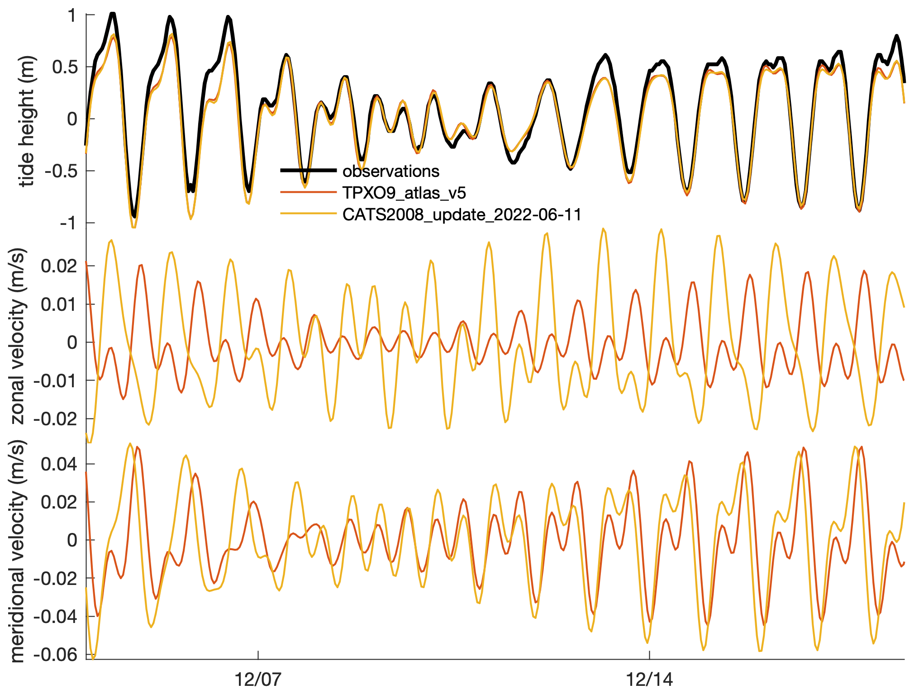
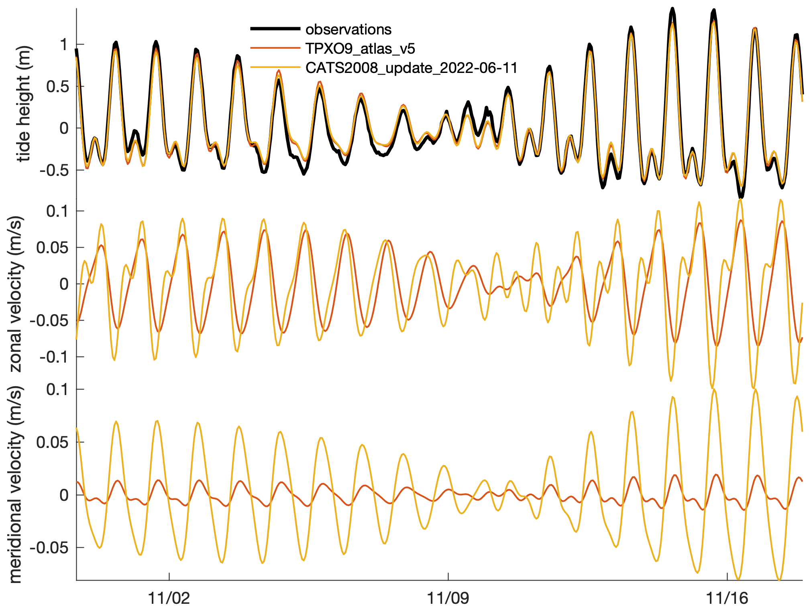
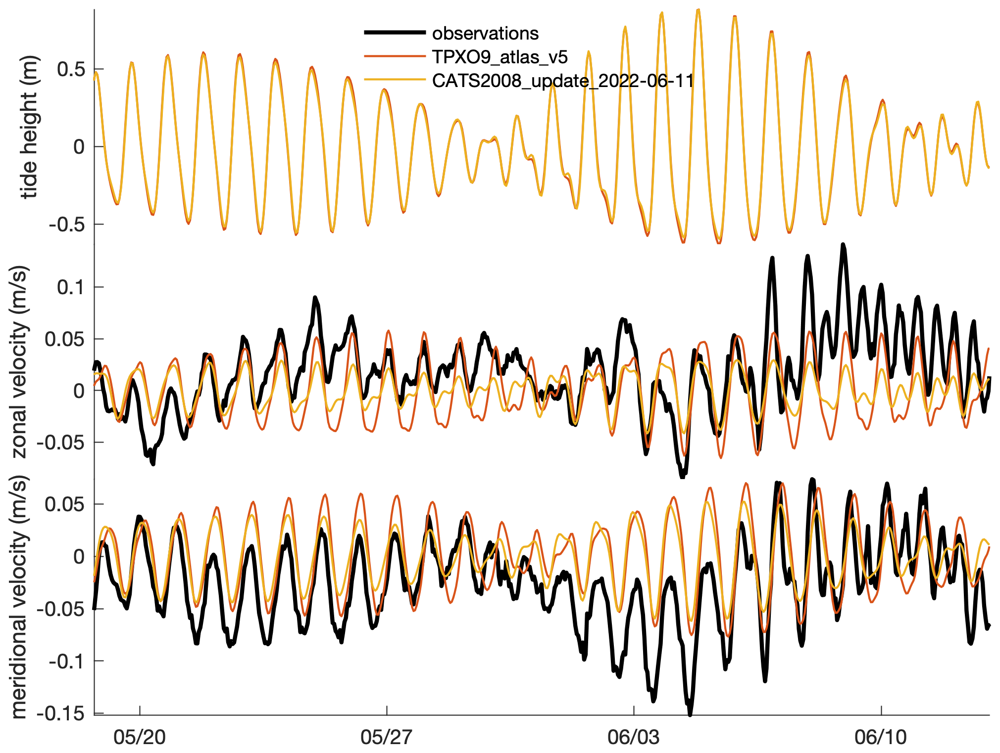
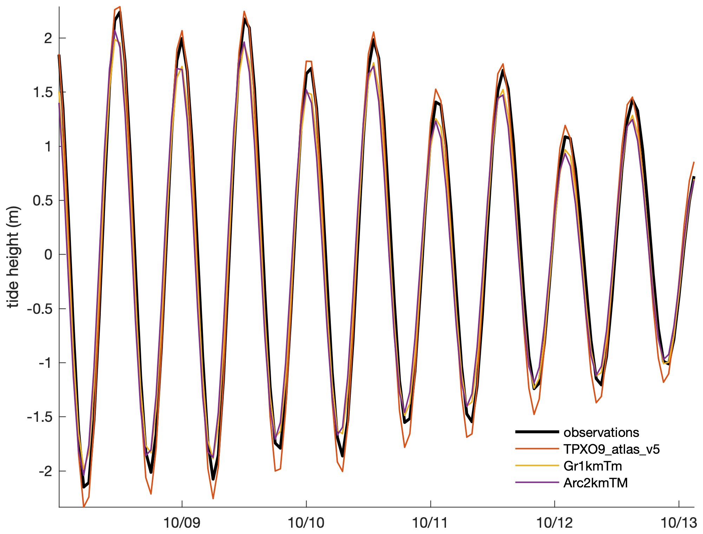

[&larr; Back to TMD3.0 Main Page](../README.md)

# Tide Model Intercomparison
The primary purpose of this page is to verify that tide models have been converted to the consolidated NetCDF format correctly. 

## Tide height measurements near Skua Island, Antarctica 
The plots on this page use the `subsubplot` function from Climate Data Toolbox (Greene et al., 2019) but you can easily replace them with MATLAB's built-in `subplot` function. The only difference is how much whitespace results. 

```matlab
% Load example tide gauge data (found in the doc/example_data folder.)
fn = 'h700_skua.nc'; 
lat = ncread(fn,'lat');
lon = ncread(fn,'lon');
t = ncread(fn,'time')+datenum(1800,1,1,0,0,0); % units = 'days since 1800-01-01 00:00:00' 
sl = ncread(fn,'sea_level')/1000; 

% Predict tides at the tide gauge location: 
sl_tpxo = tmd_predict('TPXO9_atlas_v5.nc',lat,lon,t,'h');
sl_cats = tmd_predict('CATS2008_update_2022-06-11.nc',lat,lon,t,'h');

% Also predict tidal currents: 
% Predict tides at the tide gauge location: 
u_tpxo = tmd_predict('TPXO9_atlas_v5.nc',lat,lon,t,'u');
u_cats = tmd_predict('CATS2008_update_2022-06-11.nc',lat,lon,t,'u');
v_tpxo = tmd_predict('TPXO9_atlas_v5.nc',lat,lon,t,'v');
v_cats = tmd_predict('CATS2008_update_2022-06-11.nc',lat,lon,t,'v');

% Plot observed and predicted tides: 
figure
subsubplot(3,1,1)
p(1)=plot(t,sl-mean(sl,'omitnan'),'k','linewidth',2);
hold on
p(2)=plot(t,sl_tpxo,'linewidth',1);
p(3)=plot(t,sl_cats,'linewidth',1);
ylabel 'tide height (m)'
legend('observations','TPXO9_atlas_v5','CATS2008_update_2022-06-11',...
   'interpreter','none','location','best')
legend boxoff
box off
axis tight
xlim([725709.92     725724.55])
datetick('x','keeplimits')

% Plot tidal currents:
subsubplot(3,1,2)
hold on
plot(t,u_tpxo,'linewidth',1,'color',p(2).Color);
plot(t,u_cats,'linewidth',1,'color',p(3).Color);
ylabel 'zonal velocity (m/s)'
box off
axis tight
xlim([725709.92     725724.55])
datetick('x','keeplimits')

subsubplot(3,1,3)
hold on
plot(t,v_tpxo,'linewidth',1,'color',p(2).Color);
plot(t,v_cats,'linewidth',1,'color',p(3).Color);
ylabel 'meridional velocity (m/s)'
box off
axis tight
xlim([725709.92     725724.55])
datetick('x','keeplimits')
```



Above, the heights look good, but the velocities don't agree. That's likely due to differences in water column thickness (transports are divided by wct to get column-averaged velocity):

```matlab
wct_tpxo = tmd_interp('TPXO9_atlas_v5.nc','wct',lat,lon);
wct_cats = tmd_interp('CATS2008_update_2022-06-11.nc','wct',lat,lon);

>> [wct_tpxo wct_cats]
ans =
        259.55        113.80
```

## Tide height measurements near Astrolabe Glacier, Antarctica: 

```matlab
% Load example tide gauge data (found in the doc/example_data folder.)
fn = 'h189_astrolabe.nc'; 
lat = ncread(fn,'lat');
lon = ncread(fn,'lon');
t = ncread(fn,'time')+datenum(1800,1,1,0,0,0); % units = 'days since 1800-01-01 00:00:00' 
sl = ncread(fn,'sea_level')/1000; 

% Predict tides at the tide gauge location: 
sl_tpxo = tmd_predict('TPXO9_atlas_v5.nc',lat,lon,t,'h');
sl_cats = tmd_predict('CATS2008_update_2022-06-11.nc',lat,lon,t,'h');
u_tpxo = tmd_predict('TPXO9_atlas_v5.nc',lat,lon,t,'u');
u_cats = tmd_predict('CATS2008_update_2022-06-11.nc',lat,lon,t,'u');
v_tpxo = tmd_predict('TPXO9_atlas_v5.nc',lat,lon,t,'v');
v_cats = tmd_predict('CATS2008_update_2022-06-11.nc',lat,lon,t,'v');

% Plot observed and predicted tides: 
figure
subsubplot(3,1,1)
p(1)=plot(t,sl-mean(sl,'omitnan'),'k','linewidth',2);
hold on
p(2)=plot(t,sl_tpxo,'linewidth',1);
p(3)=plot(t,sl_cats,'linewidth',1);
ylabel 'tide height (m)'
legend('observations','TPXO9_atlas_v5','CATS2008_update_2022-06-11',...
   'interpreter','none','location','best')
legend boxoff
box off
axis tight
xlim([733711.67     733729.88])
datetick('x','keeplimits')

% Plot tidal currents:
subsubplot(3,1,2)
hold on
plot(t,u_tpxo,'linewidth',1,'color',p(2).Color);
plot(t,u_cats,'linewidth',1,'color',p(3).Color);
ylabel 'zonal velocity (m/s)'
box off
axis tight
xlim([733711.67     733729.88])
datetick('x','keeplimits')

subsubplot(3,1,3)
hold on
plot(t,v_tpxo,'linewidth',1,'color',p(2).Color);
plot(t,v_cats,'linewidth',1,'color',p(3).Color);
ylabel 'meridional velocity (m/s)'
box off
axis tight
xlim([733711.67     733729.88])
datetick('x','keeplimits')
```



Above, the heights look good, but the velocities don't agree. That's likely due to differences in water column thickness (transports are divided by wct to get column-averaged velocity):

```matlab
wct_tpxo = tmd_interp('TPXO9_atlas_v5.nc','wct',lat,lon);
wct_cats = tmd_interp('CATS2008_update_2022-06-11.nc','wct',lat,lon);

>> [wct_tpxo wct_cats]
ans =
        297.18         54.68
```
The difference in water column thickness explains the big difference in magnitudes of the velocity predictions. Phase, not so much. 

## Tidal current observations near Getz Ice Shelf, Antarctica 
% This data is explored in more detail in the [Tidal Current Tutorial](tutorial_currents.md). 

```
t = ncread('ADCP_S112.nc','time') + datenum(1950,1,1,0,0,0); 
lat = ncread('ADCP_S112.nc','lat'); 
lon = ncread('ADCP_S112.nc','lon'); 
z = ncread('ADCP_S112.nc','z'); 
u = mean(ncread('ADCP_S112.nc','u'),'omitnan'); 
v = mean(ncread('ADCP_S112.nc','v'),'omitnan'); 

% Predict tides at the tide gauge location: 
sl_tpxo = tmd_predict('TPXO9_atlas_v5.nc',lat,lon,t,'h');
sl_cats = tmd_predict('CATS2008_update_2022-06-11.nc',lat,lon,t,'h');
u_tpxo = tmd_predict('TPXO9_atlas_v5.nc',lat,lon,t,'u');
u_cats = tmd_predict('CATS2008_update_2022-06-11.nc',lat,lon,t,'u');
v_tpxo = tmd_predict('TPXO9_atlas_v5.nc',lat,lon,t,'v');
v_cats = tmd_predict('CATS2008_update_2022-06-11.nc',lat,lon,t,'v');

% Plot observed and predicted tides: 
figure
subsubplot(3,1,1)
p(1)=plot(nan,nan,'k','linewidth',2); % placeholder
hold on
p(2)=plot(t,sl_tpxo,'linewidth',1);
p(3)=plot(t,sl_cats,'linewidth',1);
ylabel 'tide height (m)'
legend('observations','TPXO9_atlas_v5','CATS2008_update_2022-06-11',...
   'interpreter','none','location','best')
legend boxoff
box off
axis tight
xlim([735007.70     735033.06])
datetick('x','keeplimits')

% Plot tidal currents:
subsubplot(3,1,2)
hold on
plot(t,u,'k','linewidth',2)
plot(t,u_tpxo,'linewidth',1,'color',p(2).Color);
plot(t,u_cats,'linewidth',1,'color',p(3).Color);
ylabel 'zonal velocity (m/s)'
box off
axis tight
xlim([735007.70     735033.06])
datetick('x','keeplimits')

subsubplot(3,1,3)
hold on
plot(t,v,'k','linewidth',2)
plot(t,v_tpxo,'linewidth',1,'color',p(2).Color);
plot(t,v_cats,'linewidth',1,'color',p(3).Color);
ylabel 'meridional velocity (m/s)'
box off
axis tight
xlim([735007.70     735033.06])
datetick('x','keeplimits')
```


## Tide height observations near Nuuk, Greenland 
Note, the Nuuk tide gauge is too close to shore for the Arc2km model, so we have to "unmask" the solution there. 

```matlab
% Load example tide gauge data (found in the doc/example_data folder.)
fn = 'h820_nuuk.nc'; 
lat = ncread(fn,'lat');
lon = ncread(fn,'lon');
t = ncread(fn,'time')+datenum(1800,1,1,0,0,0); % units = 'days since 1800-01-01 00:00:00' 
sl = ncread(fn,'sea_level')/1000; 

% Predict tides at the tide gauge location: 
sl_tpxo = tmd_predict('TPXO9_atlas_v5.nc',lat,lon,t,'h');
sl_Gr1km = tmd_predict('Gr1kmTM_v1.nc',lat,lon,t,'h');
sl_Arc2km = tmd_predict('Arc2kmTM_v1.nc',lat,lon,t,'h','coasts','unmask');
u_tpxo = tmd_predict('TPXO9_atlas_v5.nc',lat,lon,t,'u');
u_Gr1km = tmd_predict('Gr1kmTM_v1.nc',lat,lon,t,'u');
u_Arc2km = tmd_predict('Arc2kmTM_v1.nc',lat,lon,t,'u','coasts','unmask');
v_tpxo = tmd_predict('TPXO9_atlas_v5.nc',lat,lon,t,'v');
v_Gr1km = tmd_predict('Gr1kmTM_v1.nc',lat,lon,t,'v');
v_Arc2km = tmd_predict('Arc2kmTM_v1.nc',lat,lon,t,'v','coasts','unmask');

% Plot observed and predicted tides: 
figure
subsubplot(3,1,1)
p(1)=plot(t,sl-mean(sl,'omitnan'),'k','linewidth',2);
hold on
p(2)=plot(t,sl_tpxo,'linewidth',1);
p(3)=plot(t,sl_Gr1km,'linewidth',1);
p(4)=plot(t,sl_Arc2km,'linewidth',1);
ylabel 'tide height (m)'
legend('observations','TPXO9_atlas_v5','Gr1kmTm','Arc2kmTM',...
   'interpreter','none','location','best')
legend boxoff
box off
axis tight
xlim([736976.01     736981.12])
datetick('x','keeplimits')

% Plot tidal currents:
subsubplot(3,1,2)
hold on
plot(t,u_tpxo,'linewidth',1,'color',p(2).Color);
plot(t,u_Gr1km,'linewidth',1,'color',p(3).Color);
plot(t,u_Arc2km,'linewidth',1,'color',p(4).Color);
ylabel 'zonal velocity (m/s)'
box off
axis tight
xlim([736976.01     736981.12])
datetick('x','keeplimits')

subsubplot(3,1,3)
hold on
plot(t,v_tpxo,'linewidth',1,'color',p(2).Color);
plot(t,v_Gr1km,'linewidth',1,'color',p(3).Color);
plot(t,v_Arc2km,'linewidth',1,'color',p(4).Color);
ylabel 'meridional velocity (m/s)'
box off
axis tight
xlim([736976.01     736981.12])
datetick('x','keeplimits')
```


## Author Info
This intercomparison was written by [Chad A. Greene](https://www.chadagreene.com) in June 2022. 