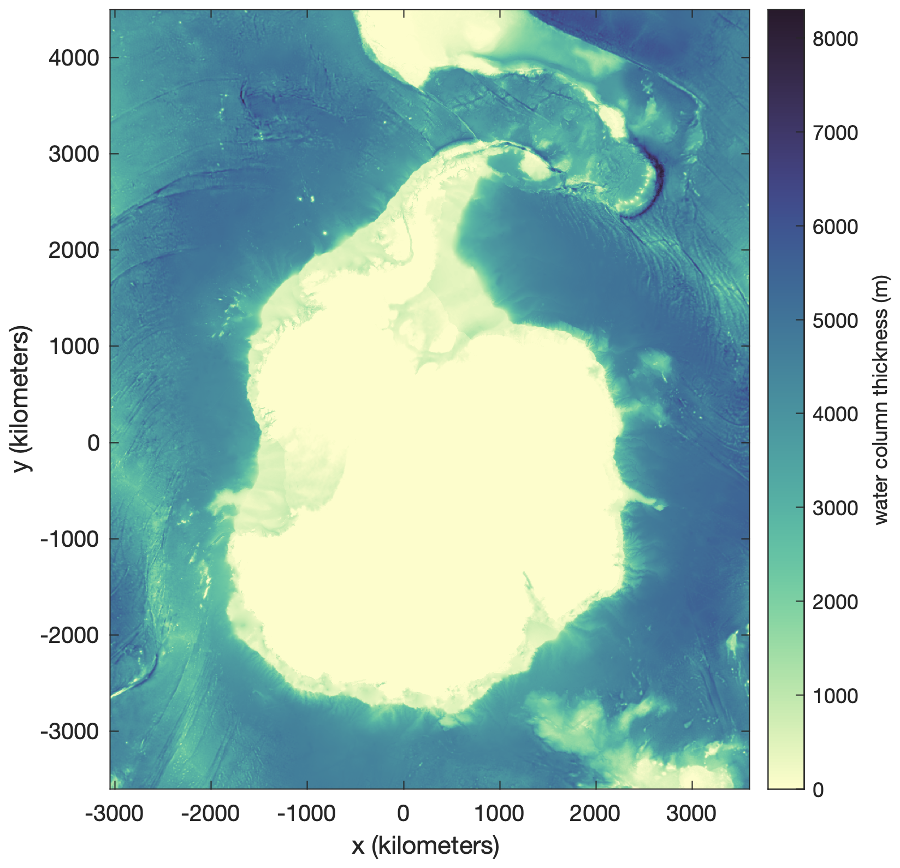
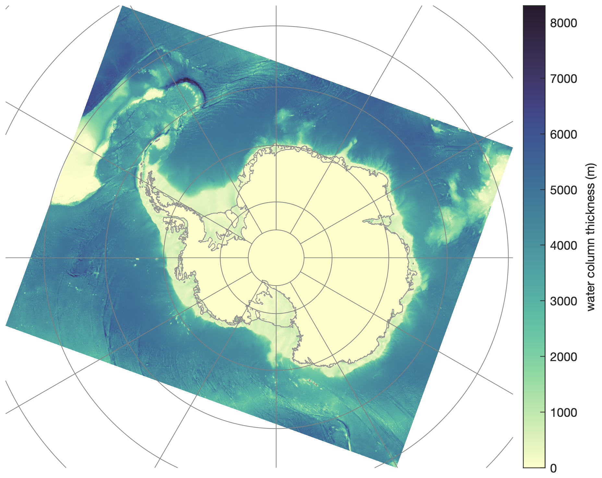
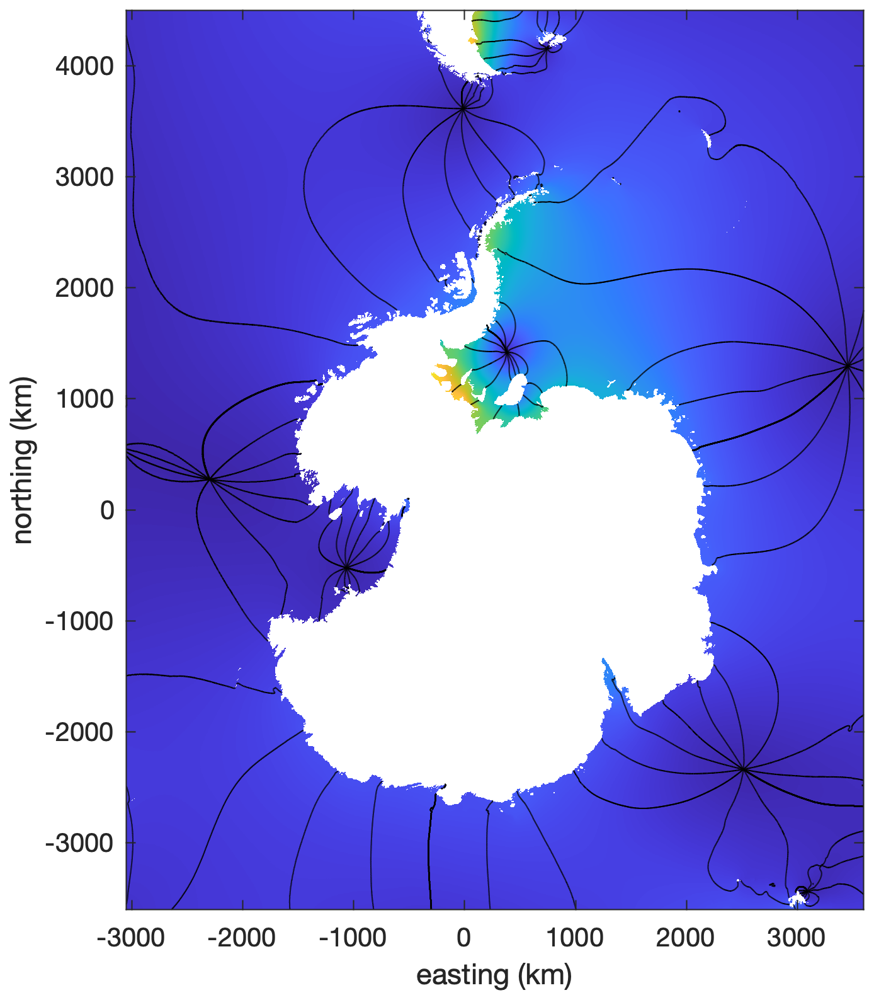
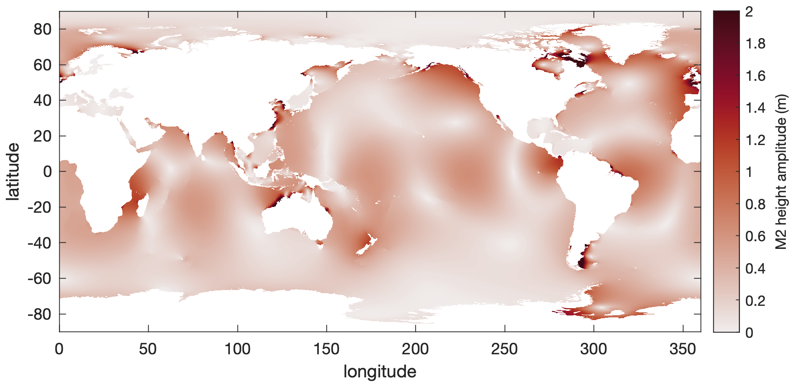
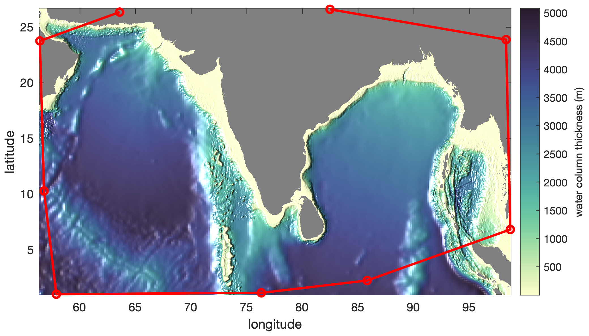

[&larr; Back to TMD3.0 Main Page](../README.md)

# `tmd_data` documentation
`tmd_data` loads tide model data into the Matlab workspace. 

See also: [`tmd_interp`](tmd_interp_documentation.md) and [`tmd_predict`](tmd_predict_documentation.md). 

## Syntax 
```matlab
[Z,x,y] = tmd_data(filename,variable)
[...] = tmd_data(...,'constituents',conList)
[...] = tmd_data(...,'bounds',[xi yi])
[Z,lon,lat] = tmd_data(...,'geo')
[...,cons] = tmd_data(...)
```
## Description 

`[Z,x,y] = tmd_data(filename,variable)` loads any of the following variables from a given tide model file: 

* `'h'`   complex tidal height (m)  
* `'hRe'` real part of tidal height
* `'hIm'` imaginary part of tidal height 
* `'hAm'` amplitude of tidal height
* `'hPh'` phase of tidal height
* `'u'`   complex zonal velocity (m/s) 
* `'uRe'` real part of zonal velocity 
* `'uIm'` imaginary part of zonal velocity 
* `'uAm'` amplitude of zonal velocity
* `'uPh'` phase of zonal velocity
* `'U'`   complex zonal transport (m^2/s) 
* `'URe'`  real part of zonal transport
* `'UIm'` imaginary part of zonal transport
* `'UAm'` amplitude of zonal transport
* `'UPh'` phase of zonal transport 
* `'v'`   complex meridional velocity (m/s) 
* `'vRe'` real part of meridional velocity 
* `'vIm'` imaginary part of meridional velocity
* `'vAm'` amplitude of meridional velocity
* `'vPh'` phase of meridional velocity 
* `'V'`   complex meridional transport (m^2/s)
* `'VRe'` real part of meridional transport 
* `'VIm'` imaginary part of meridional transport
* `'VAm'` amplitude of meridional transport
* `'VPh'` phase of meridional transport
* `'wct'` water column thickness (m) 
* `'mask'` binary land/ocean mask
* `'flexure'` ice shelf flexure coefficient from a linear elastic model applied to BedMachine ice thickness (can slightly exceed 1). Only for CATS model. 

`[...] = tmd_data(...,'constituents',conList)` specifies tidal constituents as a 
cell array (e.g, `{'m2','s2'}`). If constituents are not specified, all model
constituents are returned. 

`[...] = tmd_data(...,'bounds',[xi yi])` enter an Mx2 matrix of coordinates 
to only load data in a rectangle around the specified `[xi(:) yi(:)]` where
`xi` and `yi` are projected coordinates for tide models that are in projected
coordinates. For tide models in geo coordinates (global tide models,
generally), `xi` refers to longitudes of interest and `yi` is latitudes of interest. 
The advantage of specifying bounds is to minimize the amount of data that
are loaded, when only a small area within a larger tide model is of
interest. 

`[Z,lon,lat] = tmd_data(...,'geo')` returns grid coordinates as
geographic coordinates. This is the default behavior for global models,
whereas regional models return projected coordinates by default. 

`[...,cons] = tmd_data(...)` returns a list of constituents in the model.  

## Example: Exploring tide model data
Explore the model data for the height variable `h` in the CATS model.
(Here I'm defining `fn` as the filename of the version of CATS I'm
working on at the moment, but you may have a different model filename.)

```matlab
% Filename: 
fn = 'CATS2008_v2022.nc';

% Load complex height coefficients:
[h,x,y,cons] = tmd_data(fn,'h'); 

% Examine outputs: 
whos h x y cons
  Name         Size                      Bytes  Class     Attributes

  cons         1x10                       1080  cell                
  h         4051x3325x10            2155132000  double    complex   
  x         3325x1                       26600  double              
  y         4051x1                       32408  double    
```

## 
Above, we see that `h` is a complex variable whose dimensions correspond to `y`, `x`, and the constituents in the model. 

## Example: Water column thickness
Using the same CATS filename `fn` we defined above, load and plot the water column
thickness:

```matlab
% Load water column thickness:
[wct,x,y] = tmd_data(fn,'wct'); 

figure
imagesc(x,y,wct)
axis xy image 
xlabel 'x (kilometers') 
ylabel 'y (kilometers')
cb = colorbar; 
ylabel(cb,'water column thickness (m)') 
cmocean deep % optional colormap 
```

<p align="center"></p>

## Example: Geographic coordinates from a regional model
You see above that the regional CATS model was generated in a nonstandard projection. If you don't want to work in the CATS model coordinates, you can unproject them yourself with `tmd_ps2ll` or you can include the `'geo'` flag to get the geographic coordinates when you call `tmd_data`.

Below, I'm plotting with [Antarctic Mapping Tools](https://github.com/chadagreene/Antarctic-Mapping-Tools)' `pcolorps` function, but you can use `lat` and `lon` with any geographic plotting functions like MATLAB's `pcolorm` or M_Map's `m_pcolor`: 

```matlab
[wct,lon,lat] = tmd_data(fn,'wct','geo'); 

figure
pcolorps(lat,lon,wct) % requires AMT
bedmachine % plots Antarctic coastline, if you have the bedmachine toolbox
cb = colorbar; 
ylabel(cb,'water column thickness (m)') 
cmocean deep % optional colormap 
axis tight off
graticuleps % geographic grid lines 
```

<p align="center"></p>

## Example: Constituent amplitude and phase
Here's how you may load and plot the amplitude and phase of the s2 constituent from a model file: 

```matlab
[hAm,x,y] = tmd_data(fn,'hAm','constituents','s2');  
hPh = tmd_data(fn,'hPh','constituents','s2'); 
ocean = tmd_data(fn,'mask'); 

Mask out land areas: 
hAm(~ocean) = NaN; 
hPh(~ocean) = NaN; 

figure
h=imagesc(x,y,hAm);
h.AlphaData = ocean; % makes land transparent
axis xy image
hold on
contour(x,y,rad2deg(hPh),-180:30:180,'k')
xlabel 'easting (km)' 
ylabel 'northing (km)' 
caxis([0 1.2])
```

<p align="center"></p>

## Example: A global model
Working with global models is very similar to working with regional models. The only real difference is we let lon=x and lat=y. Here's an example: 

```matlab
% Load the M2 global tidal height amplitude: 
[M2,lon,lat] = tmd_data('TPXO9_atlas_v5.nc','hAm','constituents','m2'); 

% Load the global ocean mask: 
ocean = tmd_data('TPXO9_atlas_v5.nc','mask'); 

figure
h=imagesc(lon,lat,M2);
h.AlphaData = ocean; % makes land transparent
axis xy image
cb = colorbar; 
ylabel(cb,'M2 height amplitude (m)') 
xlabel('longitude')
ylabel('latitude') 
caxis([0 2])
cmocean amp % optional colormap
```

<p align="center"></p>

## Example: Load a small area of data 
Let's say you want to use a global tide model, but you're only interested in the ocean around India. In such cases, you may not want to load the entire global dataset, so load the data surrounding your region of interest by specifiying the bounds as an Nx2 array, defining any number N data points whose x (or longitude for a global model) values are the first column, and y values (or latitude for a global model) are the second column. 

Below, I'm setting the colormap with the `cmocean` function, and adding
hillshade with `shadem`, both of which are in the [Climate Data Toolbox for Matlab](https://github.com/chadagreene/CDT)
(Greene et al., 2019). 

```matlab
% Some points defining your region of interest: 
loni = [63.57 56.40 56.77 57.88 76.30 85.81 98.67 98.29 82.47];
lati = [26.36 23.77 10.30  1.03  1.15  2.26  6.84 23.89 26.61];    

% Load model data around the points of interest: 
[wct,lon,lat] = tmd_data('TPXO9_atlas_v5.nc','wct','bounds',[loni(:) lati(:)]); 
ocean = tmd_data('TPXO9_atlas_v5.nc','mask','bounds',[loni(:) lati(:)]); 

Set land areas to NaN:
wct(~ocean) = nan;

figure
pcolor(lon,lat,wct)
shading interp
set(gca,'color',.5*[1 1 1]) % sets background (land) to gray
axis xy image
cb = colorbar; 
ylabel(cb,'water column thickness (m)') 
hold on
plot(loni,lati,'ro-','linewidth',2)
xlabel 'longitude'
ylabel 'latitude'
cmocean deep % optional colormap
shadem(-13) % a tiny bit of hillshade
```

<p align="center"></p>

## Author Info 
The `tmd_data` function and its documentation were written by Chad A.
Greene, June 2022. 