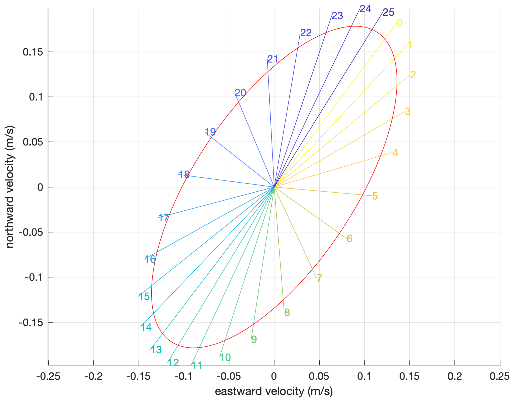

[&larr; Back to TMD3.0 Main Page](../README.md)

# `tmd_ellipse` documentation
`tmd_ellipse` gives tidal ellipse parameters at specified location(s).  

## Syntax

```matlab
[umajor,uminor,uphase,uincl] = tmd_ellipse(filename,constituent,lati,loni)
```

## Description

`[umajor,uminor,uphase,uincl] = tmd_ellipse(filename,constituent,lati,loni)` gives the major and minor axes of tidal current velocities. 

**Inputs:**
 
* `filename` TMD3.0 compatible tide model ending in .nc. 
* `constituent` string constituent (e.g., 'm2') 
* `lati,loni` geographic coordinates (can be any size, but must be equal size)

**Outputs:**

* `umajor` Major axis, the largest current for the constituent (m/s). Always positive. 
* `uminor` Minor axis, the smallest current (m/s). Negative uminor indicates clockwise flow.  
* `uphase` Reference point on the ellipse (degrees)
* `uincl` Inclination (degrees)

## Example 
Get the tidal ellipse parameters for the o1 constituent:

```matlab
fn = 'CATS2008_v2022.nc'; 
lat = -71.9102; 
lon =  172.6590;

% Get ellipse parameters: 
[umaj,umin,uphase,uincl] = tmd_ellipse(fn,'o1',lat,lon);

% Print the numbers: 
[umaj umin uphase uincl]
ans =
    0.2060   -0.0886   36.9514   56.3513
```

The numbers above describe a clockwise flow (negative umin) with a maximum tidal velocity of 20.6 cm/s. 

### Explanation of the ellipse parameters
What exactly do the major and minor axes mean? Let's dig in to what the o1 constituent looks like at this location. For this, we will plot one complete cycle of tidal currents for the o1 constituent. How long does it take to complete one o1 cycle? 

```matlab
% Get the o1 constituent angular frequency (rad/s):
[~,~,~,omega] = tmd_constit('o1'); 

% Convert omega to period in days: 
T = (2*pi/omega)/(24*60*60) 
T =
    1.0758
```

The o1 constituent has a period of about 1.08 days, so we'll start by making  an hourly time array that spans 1.08 days. Then we'll solve tidal currents  u and v at times t for the location defined above. 

```matlab
% Hourly time array spanning one o1 period: 
t = datenum(2022,1,1):1/24:(datenum(2022,1,1)+T); 

% Predict hourly tides, considering only the o1 constituent: 
u = tmd_predict(fn,lat,lon,t,'u','constituent','o1'); 
v = tmd_predict(fn,lat,lon,t,'v','constituent','o1'); 

% Define an array of colors:
col = flipud(parula(length(t))); 

figure
hold on
for k=1:length(t)
    plot([0 u(k)],[0 v(k)],'color',col(k,:));
    text(u(k),v(k),num2str(k-1),'color',col(k,:))
end
grid on
axis equal
xlabel 'eastward velocity (m/s)' 
ylabel 'northward velocity (m/s)' 
```


Above, we see that at hour 0, o1 current velocity was to the northeast. The negative value of `umin` already told us it's a clockwise ellipse, and as expected, the current sweeps through an elliptical path over the course of the day, ending up back at the starting place just under 26 hours later. 
 
Here is an ellipse plotted directly from the tidal ellipse parameters: 

```matlab
% Equation of an unrotated ellipse: 
foo = linspace(0,2*pi,500); 
x = umaj*cos(foo); 
y = umin*sin(foo); 

% Rotate the ellipse: 
[theta,r] = cart2pol(x,y);
[xr,yr] = pol2cart(theta+uincl*pi/180,r);

% Plot the rotated ellipse:
plot(xr,yr,'r')
```



### Are the ellipse parameters wrong? 
Here's a question I do not know the answer to: Why doesn't the red ellipse line up perfectly with the predicted hourly currents? The `umaj` and `umin` parameters are slightly smaller than necessary to meet the hourly predictions. Have I plotted the red ellipse incorrectly, is there a mistake in the `tmd_ellipse` code, or is there some fundamental concept I'm misunderstanding here? If you know the answer and this section of the doc is still on GitHub, please reach out and explain it to me. 

## References  
Foreman, M. G. G., & Henry, R. F. (1989). The harmonic analysis of tidal model time series. Advances in water resources, 12(3), 109-120. [https://doi.org/10.1016/0309-1708(89)90017-1]()

## Author Info 
The `tmd_ellipse` function and its documentation were written by Chad A. Greene & Laurie Padman, June 2022. 