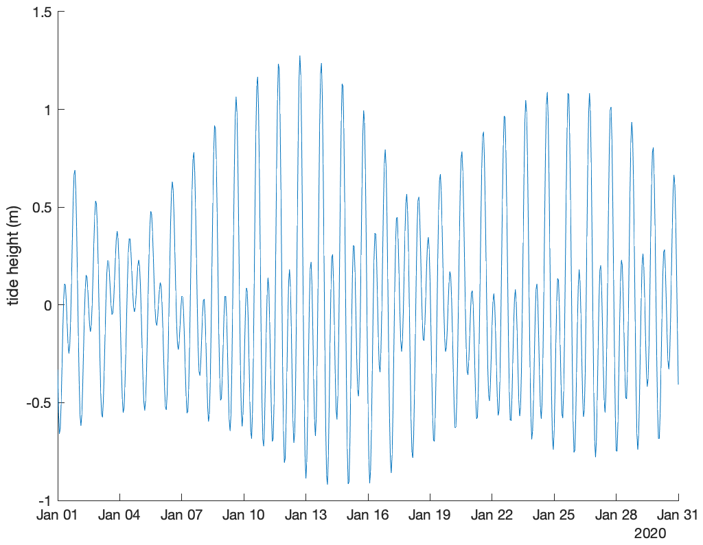
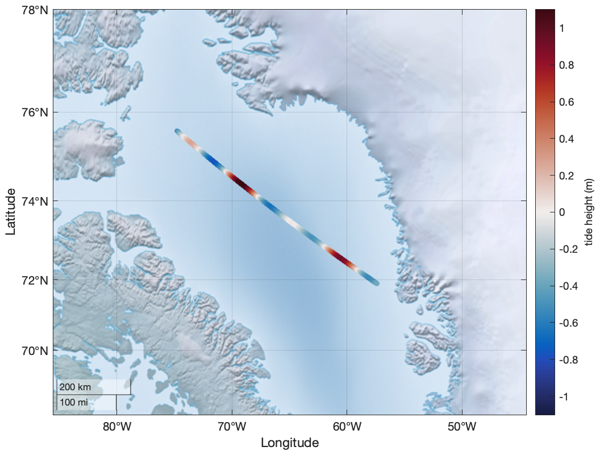
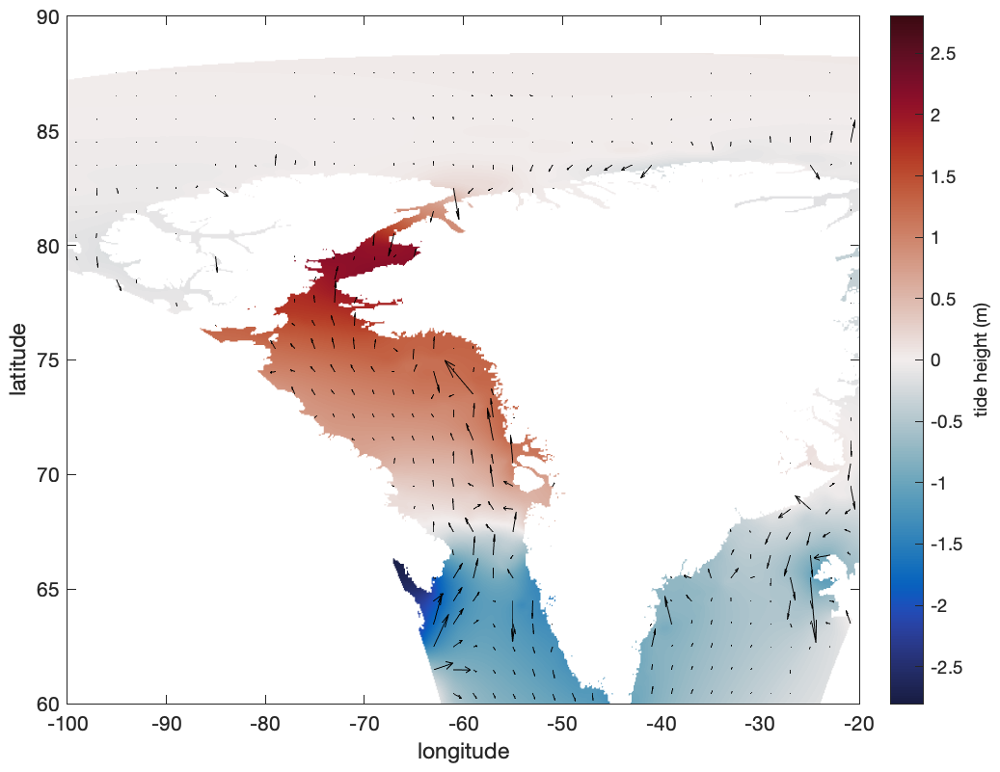
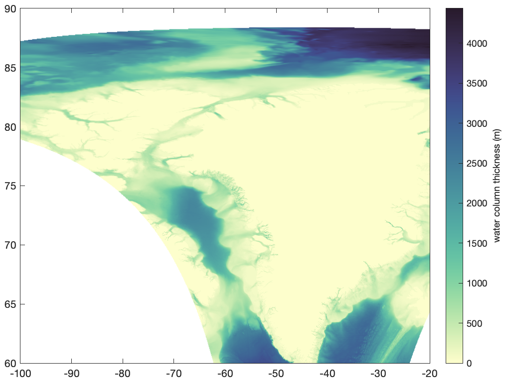
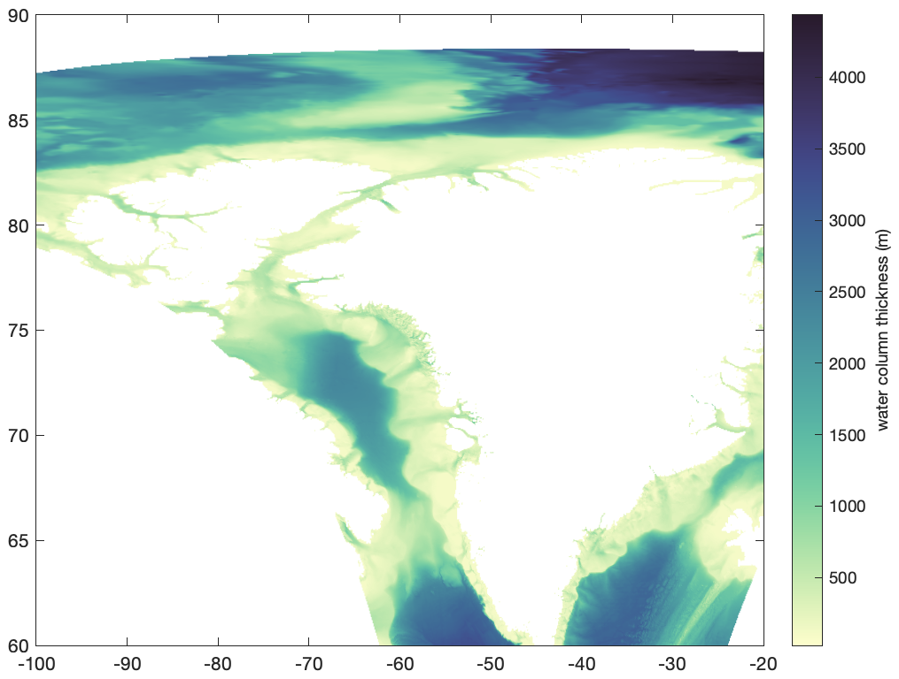
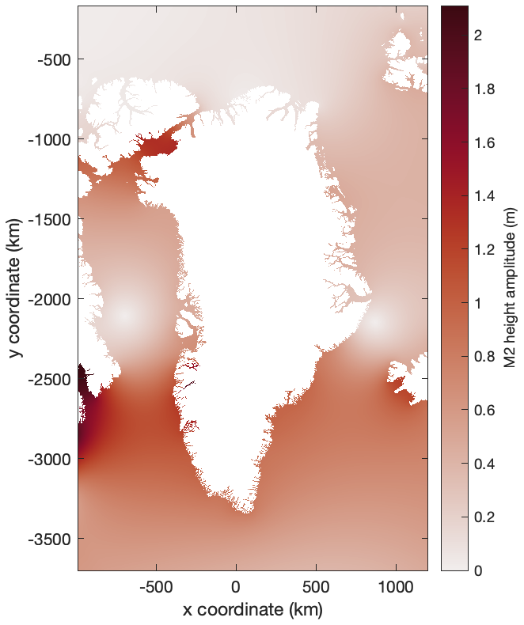

[&larr; Back to TMD3.0 Main Page](../README.md)

# Getting Started with TMD
This page contains the code from the introductory video tutorial [found on youtube](https://www.youtube.com/watch?v=CYhErY6WNL8). 

[](https://www.youtube.com/watch?v=CYhErY6WNL8 "Getting Started with Tide Model Driver for MATLAB, version 3.0")

## 1. Installing TMD 
The first step toward getting started with TMD is to install the software on your computer. The installation process is described [here](installing_tmd.md).

## 2. Getting tide model data 
After you've installed the TMD functions, you'll need some tide model data. [Click here for a list of all available tide model data](tide_model_data.md). 

## 3. Getting help 
#### Online
The most up-to-date documentation can always be found on the main page of the [TMD GitHub repo](https://github.com/chadagreene/Tide-Model-Driver). There you can also post issues if you find any bugs in the code.  

#### In MATLAB

If you're in MATLAB and you want help with a specific function, you can get plain-text help in the Command Window by typing `help` followed by the name of the function. For example: 

```matlab
>> help tmd_predict
```
To access formatted documentation with lots of examples for any of the primary TMD functions, type `tmd` followed by the function name. For example:

```matlab
>> tmd tmd_predict
```
If you're not sure what function name you're looking for, just type `tmd` into the Command Window, and it will bring up a complete function list:

```matlab
>> tmd 
```

## 4. Predicting tides 
The procedure for predicting tides is described in detail in the documentation for the [`tmd_predict`](tmd_predict_documentation.md) function, but we'll cover a few quick examples here. After downloading your favorite tide model data file, unzip it, [make sure MATLAB can find it](https://www.mathworks.com/help/matlab/ref/addpath.html), and then enter the location and times that you want to predict tides. 

### Single-location time series
Use the Gr1kmTM_v1 tide model to predict tides in Baffin Bay (74.6°N, 68.2°W) for the month of January, 2020, at hourly resolution: 

```matlab
% Define a time array: 
t = datetime('jan 1, 2020'):hours(1):datetime('jan 31, 2020'); 

% Predict the tide time series: 
z = tmd_predict('Gr1kmTM_v1.nc',74.6,-68.2,t); 

figure
plot(t,z) 
box off
ylabel('tide height (m)') 
```
<p align="center"></p>

### Drift-track time series
Predicting a drift track is very similar to predicting a single-location time series, except you'll enter lat,lon arrays that are the same size as the time array. 

Let's say you take a boat across Baffin Bay for two days in January 2020 and you want to predict tides along the path. The red in the scatterplot below corresponds to high tides you'll encounter along your journey. 

```matlab
% Two day time series: 
t = datetime('jan 10, 2020'):minutes(1):datetime('jan 12, 2020'); 

% Corresponding locations: 
lat = linspace(75.6,71.9,length(t));
lon = linspace(-74.8,-57.4,length(t));

z = tmd_predict('Gr1kmTM_v1.nc',lat,lon,t); 

figure
geoscatter(lat,lon,20,z,'filled')
geolimits([68 78],[-85 -45])
geobasemap colorterrain
caxis([-1 1]*1.1)
cb = colorbar; 
ylabel(cb,'tide height (m)')
cmocean balance optional colormap 
```
<p align="center"></p>

### Map-view snapshot
Suppose you just want a snapshot of the geographic distribution of tide heights across a wide area at a single instant. Let's pick 4:15 pmon January 12, 2020, and we'll choose an area around Baffin Bay. 

```matlab
% Define arrays of equally spaced lat,lon locations: 
lat = 60:0.05:90; 
lon = -100:0.1:-20; 

% Turn the arrays into grids: 
[Lon,Lat] = meshgrid(lon,lat); 

% Predict tides at 4:15 pm (UTC) on January 12, 2020: 
t = datenum('jan 12, 2020, 16:15');
Z = tmd_predict('Gr1kmTM_v1.nc',Lat,Lon,t); 

figure
pcolor(lon,lat,Z)
shading interp
cb = colorbar; 
ylabel(cb,'tide height (m)') 
caxis([-1 1]*2.8)
xlabel 'longitude'
ylabel 'latitude'
cmocean bal optional colormap from Climate Data Toolox
```
<p align="center"></p>

You may also add column-averaged water velocity vectors like this:

```matlab
u = tmd_predict('Gr1kmTM_v1.nc',Lat,Lon,t,'u'); 
v = tmd_predict('Gr1kmTM_v1.nc',Lat,Lon,t,'v'); 

hold on
q = quiversc(lon,lat,u,v,'k'); quiversc is in Climate Data Toolbox 
q.AutoScaleFactor = 1.5; lengthens the arrows 
```
<p align="center"></p>

## 5. Accessing tide model data 
You can use [`tmd_interp`](tmd_interp_documentation.md) to interpolate quantities from the model data file, like ocean masks or constituent coefficients. Here we get the water column thickness (essentially the ocean depth) at every grid point we defined above: 

```matlab
wct = tmd_interp('Gr1kmTM_v1.nc','wct',Lat,Lon); 

figure
pcolor(lon,lat,wct)
shading interp 
cb = colorbar; 
ylabel(cb,'water column thickness (m)')
cmocean deep optional colormap 
```
<p align="center"></p>

Above, the water column thickness is zero wherever there's land. Perhaps you'd prefer to set the land grid cells to NaN rather than zero. Here's how: Just interpolate the ocean mask, set the non-ocean pixels to NaN, and plot again: 

```matlab
ocean = tmd_interp('Gr1kmTM_v1.nc','mask',Lat,Lon); 

wct(~ocean) = NaN; 

figure
pcolor(lon,lat,wct)
shading interp 
cb = colorbar; 
ylabel(cb,'water column thickness (m)')
cmocean deep optional colormap 
```
<p align="center"></p>

Sometimes you don't want to interpolate, and you just want the raw data. Use <tmd_data_documentation.html 'tmd_data'> to get things like height coefficients: 

```matlab
% Load complex height coefficients:
[h,x,y,cons] = tmd_data('Gr1kmTM_v1.nc','h'); 
```

Examine the outputs: 

```matlab
>> whos h x y cons
  Name         Size                    Bytes  Class     Attributes

  cons         1x8                       864  cell                
  h         3530x2190x8            989529600  double    complex   
  x         2190x1                     17520  double              
  y         3530x1                     28240  double              
```
 
Above, we see the the Gr1kmTM_v1.nc file conntains eight tidal
constituents. Here's what they are: 

```matlab
>> cons
cons =
  1×8 cell array
    {'m2'}    {'s2'}    {'k1'}    {'o1'}    {'n2'}    {'p1'}    {'k2'}    {'q1'}
```


You can alternatively access constituents using the
[`tmd_conlist`](tmd_conlist_documentation.md) function:

```matlab
tmd_conlist('Gr1kmTM_v1.nc')
  1×8 cell array
    {'m2'}    {'s2'}    {'k1'}    {'o1'}    {'n2'}    {'p1'}    {'k2'}    {'q1'}
```

The variable `h` is a complex data cube with dimensions 3530x2190x8, which correspond to the *y* and *x* dimensions and the eight constituents. If you'd just like the *amplitude* (not complex) of the m2 coefficient, enter `hAm` and the constituent you desire, like this: 

```matlab
% Load the M2 global tidal height amplitude: 
[M2,x,y] = tmd_data('Gr1kmTM_v1.nc','hAm','constituents','m2'); 

% Load the global ocean mask: 
ocean = tmd_data('Gr1kmTM_v1.nc','mask'); 

figure
h=imagesc(x,y,M2);
h.AlphaData = ocean; makes land transparent
axis xy image sets axes equal and normal cartesian coordinates 
cb = colorbar; 
ylabel(cb,'M2 height amplitude (m)') 
xlabel('x coordinate (km)')
ylabel('y coordinate (km)') 
cmocean amp optional colormap from Climate Data Toolbox 
```
<p align="center"></p>

# Author Info
This page was written by [Chad A. Greene](https://www.chadagreene.com), January 2023.