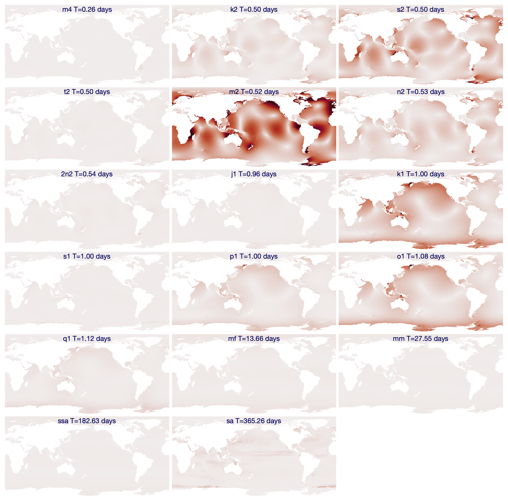

[&larr; Back to TMD3.0 Main Page](../README.md)

# How to separate climatological phenomena from gravitational tides
Tide model datasets are created by fitting sinusoids to satellite measurements of sea surface height variability. Every tidal constituent oscillates at a well known frequency, so with enough data and the known frequencies of oscillation, it's possible to invert for the amplitude and phase offset of every tidal constituent at any given location. That's all well and good, but some natural phenomena occur at the same frequency as tidal oscillation without being driven strictly by gravitational forcing. For example, a river outflow may locally increase sea level every spring, so any tidal inversion at the one-year frequency may be driven more by mountain snowmelt than by the tiny effects of nonuniform changes in the Sun's declination and distance.

This page shows how climatological variability can creep into tide models, and offers some advice on what you can do about it. 

## EOT20 Global Model
The EOT20 global tide model is described in an [ESSD paper by Hart-Davis et al., 2021](https://doi.org/10.5194/essd-13-3869-2021). In it, the authors write: 

> *The Ssa and Sa tides are included in the EOT20 model data, but users should be aware that these tides include the full signal at these periods, i.e. gravitational as well as meteorological tides. Thus, caution should be taken when interpreting the results of the tidal correction when these two tides are included as they will likely remove the seasonal signals seen in the altimeter data.*

In this tutorial, we'll explore the EOT20 model to find out what Hart-Davis et al. mean about the Sa tidal constituent. 

### Load EOT20 data 
Begin by loading the EOT20 amplitude and phase. We'll also load the ocean mask, because we'll want it when we plot the data. 

```matlab
[hAm,lon,lat,cons] = tmd_data('EOT20_ocean.nc','hAm'); 
hPh = tmd_data('EOT20_ocean.nc','hPh'); 
ocean = tmd_data('EOT20_ocean.nc','mask'); 
```

### Plot M2 constituent 
Before we jump into the Sa constituent, let's get our bearings straight by looking at the much more significant M2 constituent. 

Below, we get the index of the M2 constituent, then plot its amplitude and phase on a global map. We'll use the _amp_ colormap from the `cmocean` function in the [Climate Data Toolbox for Matlab](https://github.com/chadagreene/CDT) (*Greene et al., 2019*). The colormap below is scaled by 7 times the median value of constituent amplitude, and this value is chosen somewhat arbitrarily because it makes for a nice comparison with other constituents later on in this tutorial. 

```matlab
% Get the index of the M2 constituent: 
k = strcmpi(cons,'M2');

figure
h = imagesc(lon,lat,hAm(:,:,k)); 
h.AlphaData = ocean; % makes land transparent
axis xy image off 
hold on

% Plot phase contours: 
tmp=rad2deg(hPh(:,:,k)); 
tmp(~ocean) = nan; 
[~,hC] = contour(lon,lat,tmp,-165:30:165,'k');
hC.LineWidth = 0.1; 
hC.Color = .5*[1 1 1];

cmocean amp % optional colormap
caxis([0 7*median(hAm(:,:,k),'all','omitnan')])
title(cons{k})
cb = colorbar; 
ylabel(cb,'constituent amplitude (m)') 
```

<p align="center"></p>

The map above shows exactly what we'd expect for a well-bahaved, gravitationally driven tidal constituent. The M2 constituent has long wavelengths and varies smoothly. 

### Plot the Sa Constituent 

Now let's make the same kind of map for the Sa constituent. I'm dropping the contour lines here, becuase they get too messy to make any sense of on a global scale: 

```matlab
% Get the index of the Sa constituent: 
k = strcmpi(cons,'Sa');

figure
h = imagesc(lon,lat,hAm(:,:,k)); 
h.AlphaData = ocean; 
axis xy image off 
hold on
cmocean amp 
caxis([0 7*median(hAm(:,:,k),'all','omitnan')])
title(cons{k})
cb = colorbar; 
ylabel(cb,'constituent amplitude (m)') 
```

<p align="center"></p>

In the map above, the first thing I notice is the familiar pattern in the equatorial Pacific, which is [driven by wind stress on annual timescales](https://doi.org/10.1126/sciadv.1500560). I also see what appear to be eddies and global currents, which are unlikely to be a direct result of the perihelion-aphelion effect at the heart of the Sa constituent. 

All amplitudes are nearly zero beyond 66°S and 66°N because the FES2014b model that fills EOT20 at high latitudes includes only the (tiny) ocean component of the Sa constituent, whereas EOT20 fits tidal parameters to all observed variability. Where EOT20 does have data for the Sa constituent close to Antarctica, the spatial pattern and the timing, with a maximum in spring, suggest a possible influence from sea ice in the altimetry. 

By inspection, we can see that the majority of the variability in the map above is probably driven by climatological effects rather than gravitational effects. Depending on how you're using the tide model, that may be a good thing, or you may not want it, but it's good to be aware of which constituents are influenced by climatological effects. 

### Compare all constituent amplitudes 
How do the amplitude patterns of all 17 constituents in EOT20 compare? Let's take a look. And to see how vary by frequency, we'll plot them in order of constituent period. 

Below, I'm using `subsubplot`, `cmocean` and `ntitle` from the Climate Data Toolbox for MATALAB.

```matlab
% Get tidal frequencies: 
[~,~,~,omega] = tmd_constit(cons);

% Convert frequencies (Hz) into period (days): 
T_days = 2*pi./(omega*60*60*24); 

% Sort constituents by period: 
[T_days,ind] = sort(T_days); 
hAm = hAm(:,:,ind); 
cons = cons(ind); 

figure('pos',[10 10 940 880])
for k = 1:17
   subsubplot(6,3,k)
   h = imagesc(lon,lat,hAm(:,:,k)); 
   h.AlphaData = ocean; 
   axis xy image off 
   hold on
   cmocean amp 
   caxis([0 7*median(hAm(:,:,k),'all','omitnan')])
   ntitle([cons{k},' T=',num2str(T_days(k),'%.2f'),' days'],...
      'color',rgb('dark blue'))
end
```


In the maps above, Sa stands out for its potential influence from climatological effects. 

Before we go too much farther, I'll point out that the comparison above might present a skewed understanding of how much each constituent actually matters, because the color axis of each map was scaled relative to its overall distribution of values. A more direct comparison would place all constituents on a common color axis, like this, where we set `caxis([0 1])` for all constituents: 

```matlab
figure('pos',[10 10 940 880])
for k = 1:17
   subsubplot(6,3,k)
   h = imagesc(lon,lat,hAm(:,:,k)); 
   h.AlphaData = ocean; 
   axis xy image off 
   hold on
   cmocean amp 
   caxis([0 1])
   ntitle([cons{k},' T=',num2str(T_days(k),'%.2f'),' days'],...
      'color',rgb('dark blue'))
end
```


Above, you see that the overwhelming majority of the energy exists at the M2 frequency. There's a decent amount of energy at a few other frequencies like S2, K1, and O1, but most constituents have only a tiny influence compared to M2. 

If you look closely at Sa, you'll see that it does contain some streaks of color, and depending on your application, you may want to include Sa, or you may want to exclude it. For example, if you own a stretch of beachfront property in Hawaii and you want the most accurate sea surface height prediction possible before your next lūʻau, you probably want to include the Sa constituent in your prediction. On the other hand, if you want to remove gravitationally driven tides from gauge measurements to study the residuals for changes in seasonal climate patterns you probably want to exclude Sa from your predictions. 

## Removing Sa from predictions
If you'd like to make tide predictions, but you want to exclude certain constituents, just tell the [`tmd_predict`](tmd_predict_documentation.md) function which constituents you want to include. 

By default, `tmd_predict` uses all constituents in a model also infers minor constituents that aren't in the model. If you specify which constituents you want to solve for, `tmd_predict` then assumes you only want a solution for those constituents, without influence from minor constituents. So if you specify which constituents you want to solve for, but you still want minor constituents to be inferred, be sure to specify `'InferMinor',true`, as shown below. 

This example uses some tide gauge measurements near Nuuk, Greenland to see how well EOT20 performs when including or excluding the Sa constituent. Start by loading the tide gauge observations: 

```matlab
% Load example tide gauge data (found in the doc/example_data folder.)
fn = 'h820_nuuk.nc'; 
lat = ncread(fn,'lat');
lon = ncread(fn,'lon');
t = ncread(fn,'time')+datenum(1800,1,1,0,0,0); % units = 'days since 1800-01-01 00:00:00' 
sl = ncread(fn,'sea_level')/1000; 
```

### Create a list of constituents you *want*:
Use the [`tmd_conlist`](tmd_conlist_documentation.md) function to get a list of constituents in the EOT20 model. Then create a list of constituents excluding Sa:

```matlab
% Get a list of all constituents in EOT20: 
cons = tmd_conlist('EOT20_ocean.nc'); 

% Remove Sa from the list: 
cons_exclude = cons(~strcmpi(cons,'Sa')); 
```

Now that we have a list of constituents we want to include in the predictions, we can predict tides three different ways and compare the results: 

```matlab
% Solve tides using all major constituents and infer minor: 
z_default = tmd_predict('EOT20_ocean.nc',lat,lon,t,'h'); 

% Solve only for 16 model constituents (Sa excluded): 
z_cons = tmd_predict('EOT20_ocean.nc',lat,lon,t,'h','constituents',cons_exclude); 

% Solve for 16 model constituents and infer minor: 
z_cons_min = tmd_predict('EOT20_ocean.nc',lat,lon,t,'h',...
   'constituents',cons_exclude,'InferMinor',true); 

figure
plot(t,sl-mean(sl,'omitnan'),'linewidth',1,'color','k')
box off 
axis tight
xlim([datenum('11 sept 2018') datenum('15 sept 2018')])
datetick('x','keeplimits') 
ylabel 'tide height (m)' 
hold on
plot(t,z_default,'linewidth',1)
plot(t,z_cons,'linewidth',1)
plot(t,z_cons_min,'linewidth',1)
legend('observations','default prediction','16 cons only','16 cons + minor')
```

<p align="center"></p>

The plot above shows that whether or not we include the Sa constituent, and whether or not we infer minor constituents at this location, the predictions are all pretty similar, and they all capture the main behavior of the observations. 

One way to measure the performance of a tide prediction is to look at the residuals of the observations minus the predictions. Here's what I mean: 

```matlab
>> std([sl sl-z_default sl-z_cons sl-z_cons_min],[],'omitnan')
ans =
          1.08          0.15          0.17          0.16
```

Above, we see that the raw observations have a standard deviation of about 1.08 m. If we subtract the full tide prediction with all major constituents solved explicitly and minor constituents inferred, the residuals are about 15 cm. If we don't use the Sa constituent and we don't infer minor constituents, performance is slightly worse, with a standard deviation of 17 cm. If we exclude Sa but still infer minor constituents, the standard deviation is 16 cm. 

The residuals at the Nuuk tide gauge tell us exactly what we expect: That the EOT20 model with all constituents does a better job of matching observations than if Sa is excluded, and inferring minor constituents improves performance. It's no surprise that including Sa produces a better fit to observations, because the Sa parameters were tuned to fit observations. 

Depending on what kind of work you're doing, you may wish to include or exclude constituents like Sa. Including Sa will likely do a better job of matching observations, but may include some climatological phenomena that you might prefer to leave out of a pure tidal prediction. 

## Author Info 
This page was written by Chad A. Greene, June 2022. 
