## Tutorial: Tidal Currents
This tutorial covers how to detide and interpret ADCP (current) measurements near Getz Ice Shelf, Antarctica. Here we use the CATS tide model, but you can just as easily use any other TMD3.0 compatible if you wish.

Back to Tide Model Driver Contents.
 
## View data file contents
The first step when exploring any new dataset is to see what's in the data file. Use `ncdisp` to find out: 

```matlab 
>> ncdisp('ADCP_S112.nc')
Source:
           /Users/cgreene/Documents/data/oceanography/moorings/Mooring_structures_to_CG/ADCP_S112.nc
Format:
           netcdf4_classic
Global Attributes:
           Conventions   = 'CF-1.7'
           Description   = 'ADCP current meter time series from a mooring near Getz Ice Shelf'
           Author        = 'Anna Wåhlin'
           creation_date = '2022-06-02'
           Data_citation = 'Anna Wåhlin'
Dimensions:
           time = 16127
           z    = 44
           lat  = 1
           lon  = 1
Variables:
    time
           Size:       16127x1
           Dimensions: time
           Datatype:   double
           Attributes:
                       long_name = 'Time variable'
                       units     = 'days since 1950-01-01 00:00:00'
    z   
           Size:       44x1
           Dimensions: z
           Datatype:   double
           Attributes:
                       long_name     = 'approximate elevation relative to sea level'
                       standard_name = 'elevation'
                       units         = 'meters'
    lat 
           Size:       1x1
           Dimensions: lat
           Datatype:   double
           Attributes:
                       long_name     = 'latitude'
                       standard_name = 'latitude'
                       units         = 'degrees'
    lon 
           Size:       1x1
           Dimensions: lon
           Datatype:   double
           Attributes:
                       long_name     = 'longitude'
                       standard_name = 'longitude'
                       units         = 'degrees'
    u   
           Size:       44x16127
           Dimensions: z,time
           Datatype:   single
           Attributes:
                       long_name     = 'measured zonal current, corrected for declination'
                       standard_name = 'zonal current'
                       units         = 'm/s'
    v   
           Size:       44x16127
           Dimensions: z,time
           Datatype:   single
           Attributes:
                       long_name     = 'measured meridional current, corrected for declination'
                       standard_name = 'meridional current'
                       units         = 'm/s'
```

## Load data
Above you see that the units of time are days since Jan 1, 1950. So when we import time into Matlab's datenum format, just add the datenum of Jan 1, 1950. Load all the other data too. 

```matlab
t = ncread('ADCP_S112.nc','time') + datenum(1950,1,1,0,0,0); 
lat = ncread('ADCP_S112.nc','lat'); 
lon = ncread('ADCP_S112.nc','lon'); 
z = ncread('ADCP_S112.nc','z'); 
u = ncread('ADCP_S112.nc','u'); 
v = ncread('ADCP_S112.nc','v'); 
```

## Plot current speed
Plot "speed" as the hypotenuse of u and v: 

```matlab
figure
pcolor(t,z,hypot(u,v))
shading interp
ylabel 'depth (m)'
datetick('x','mmm-yyyy')
cb = colorbar; 
ylabel(cb,'Current speed (m/s)')
caxis([0 0.25]) % makes small signals more visible 
```
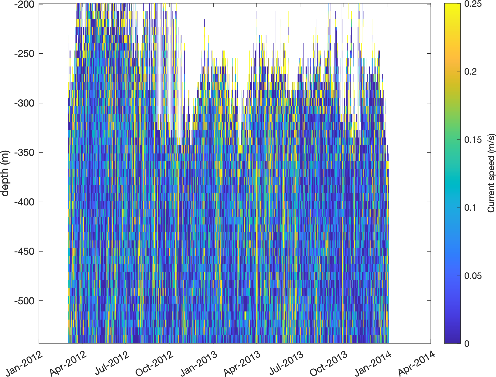

## 
 According to Anna Wåhlin: 
 
>  The missing data at the top is likely due to loss of backscatter signal, 
>  caused by too much energy being lost in the water column and/or lack of 
>  scatterers in that level. The range of this instrument is about 300 m so 
>  it is to be expected. We placed them at the bottom looking upwards in order
>  to capture the lower currents - sometimes we place a second ADCP further 
>  up in order to get the whole water column but not [at this location].
 
Let's zoom in on a few weeks to make the time series more sensible: 

```matlab
xlim([datenum(2013,1,12) datenum(2013,2,15)])
datetick('x','keeplimits')
```
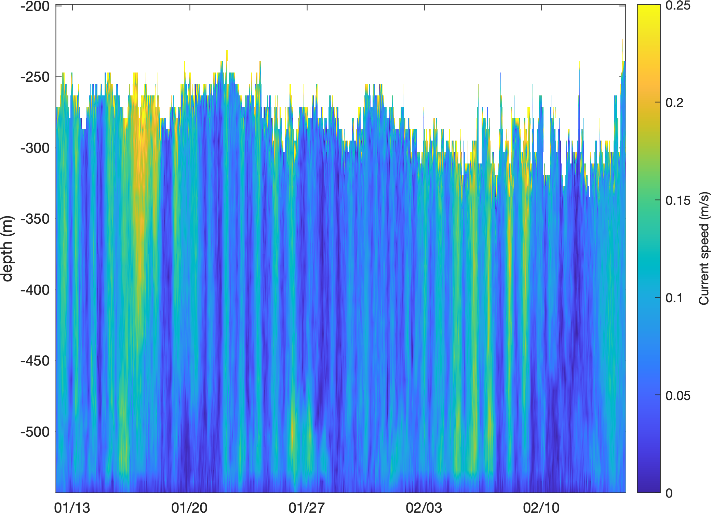

## 
Above, you can see the tidal signals pulsating the entire water column.

## Plot mean currents
Here are the mean zonal and meridional components. (Adding an 0.2 offset for display purposes): 

```matlab
u_mean = mean(u,'omitnan')'; 
v_mean = mean(v,'omitnan')'; 

offset = 0.2; % for display purposes

figure
plot(t,u_mean+offset)
hold on
plot(t,v_mean);
legend('u_{mean}+0.2','v_{mean}')
axis tight
datetick('x','mmm-yyyy')
```
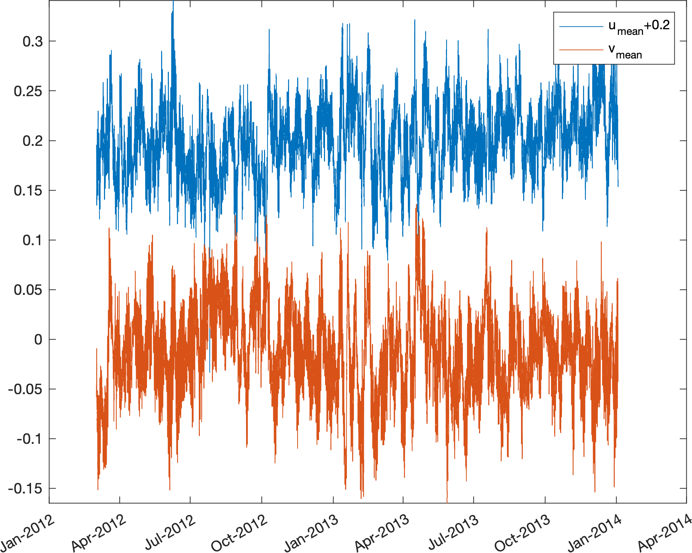


## Predict tides
Get the predicted zonal and meridional components of the tidal current at the mooring location: 

```matlab
% (My) file path to the model file: 
fn = '/Users/cgreene/Downloads/CATS2008/CATS2008_update_2022-04-22.nc'; 

% Predict tidal velocities: 
u_pred = tmd_predict(fn,lat,lon,t,'u');  
v_pred = tmd_predict(fn,lat,lon,t,'v'); 

% Add to the previous plot: 
plot(t,u_mean+offset-u_pred)
hold on
plot(t,v_mean-v_pred);
legend('u_{mean}+0.2','v_{mean}','u_{detide}+0.2','v_{detide}')
```
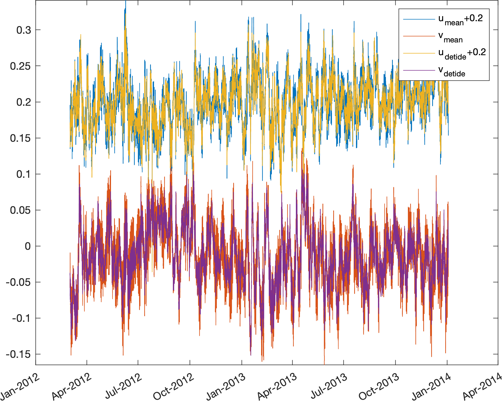

Zoom in for clarity: 

```matlab
xlim([datenum(2013,1,12) datenum(2013,2,15)])
datetick('x','keeplimits')
```
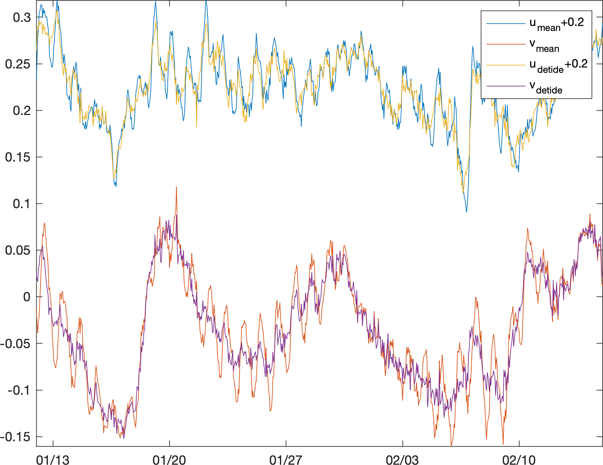

## 
Above, the tidal currents have been removed from the zonal and meridional components of the current. All that remains is the residual water flow that isn't driven by tides (and any tidal energy that wasn't perfectly accounted for in the CATS model). 

## Flow into/out of a trough
Optional: Use [Antarctic Mapping Tools](https://github.com/chadagreene/Antarctic-Mapping-Tools) with [BedMachine](https://github.com/chadagreene/BedMachine/) and [Climate Data Tools](https://github.com/chadagreene/CDT) to plot a map of the area surrounding the mooring, for context: 

```matlab
figure
mapzoomps(lat,lon,'mapwidth',700) % zooms a map on the mooring
bedmachine('bed')  plots bed depth 
bedmachine  plots grounding line 
hold on
plotps(lat,lon,'yo','linewidth',4) % mooring location
plotps(lat,lon,'ro','linewidth',2) 
caxis([-1 1]*2000)
cmocean topo % CDT topographic colormap
axis off 
shadem(4,[225 80]) % hillshade
graticuleps % lat/lon grid
```
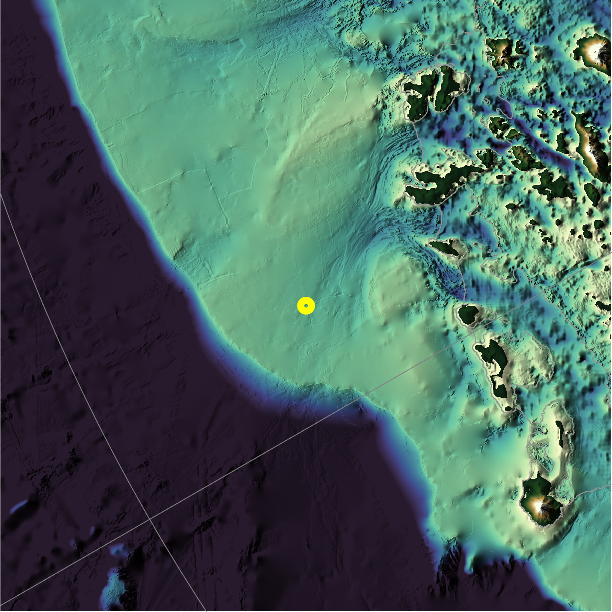

In the map above, we see the north/south motion of the water roughly corresponds to flow out/into trough that leads to Getz Ice Shelf.  Here's just the meridional component of ADCP velocity, to show flow into and out of the trough: 

```matlab
figure
pcolor(t,z,v) 
shading interp
cb = colorbar; 
ylabel(cb,'northward flow (m/s)') 
caxis([-1 1]*0.25)
cmocean -balance  colormap 
axis tight
datetick('x','mmm-yyyy')
title 'flow toward/away from Getz'
```
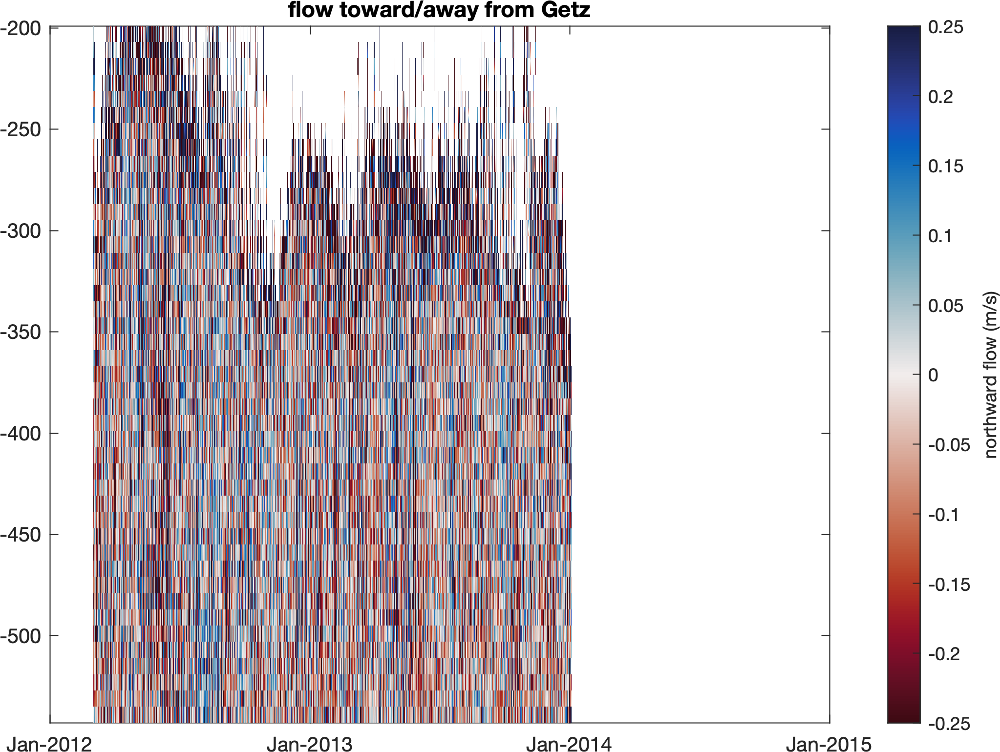

In the time series above, red flows south (toward Getz) while blue flows north. Here's a zoom-in:

```matlab
xlim([datenum(2013,1,12) datenum(2013,2,15)])
datetick('x','keeplimits')
```
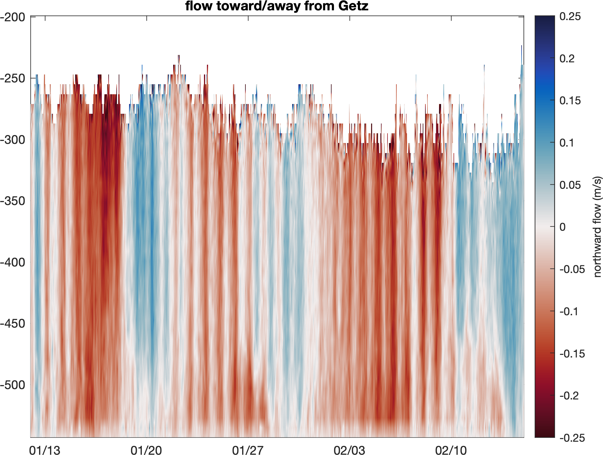

## Detide the Observations
Here's the same thing as above, but detided by subtracting the predicted tide: 

```matlab
v_detide = v - v_pred'; 

figure
pcolor(t,z,v_detide) 
shading interp
cb = colorbar; 
ylabel(cb,'northward flow (m/s)') 
caxis([-1 1]*0.25)
cmocean -balance  colormap 
axis tight
xlim([datenum(2013,1,12) datenum(2013,2,15)])
datetick('x','keeplimits')
title 'detided flow toward/away from Getz'
```
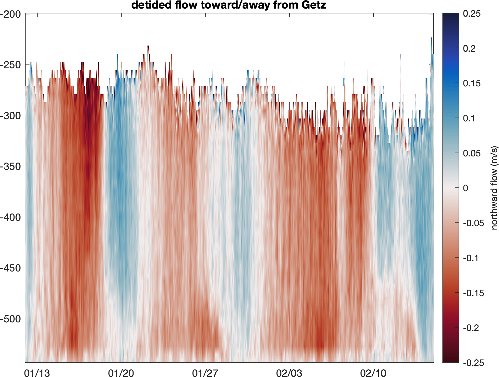

## Baroclinic flow
So far, we've applied the mean predicted tidal currents to the entire water column. In reality, the strength of any water flow in the ocean is a function of depth. Here's the mean meridional velocity at this mooring:

```matlab
v_baroclinic = mean(v,2,'omitnan'); 

figure
plot(v_baroclinic,z)
box off 
axis tight
xlabel 'meridional velocity (m/s)'
ylabel 'depth (m)' 
title 'mean meridional flow' 
```
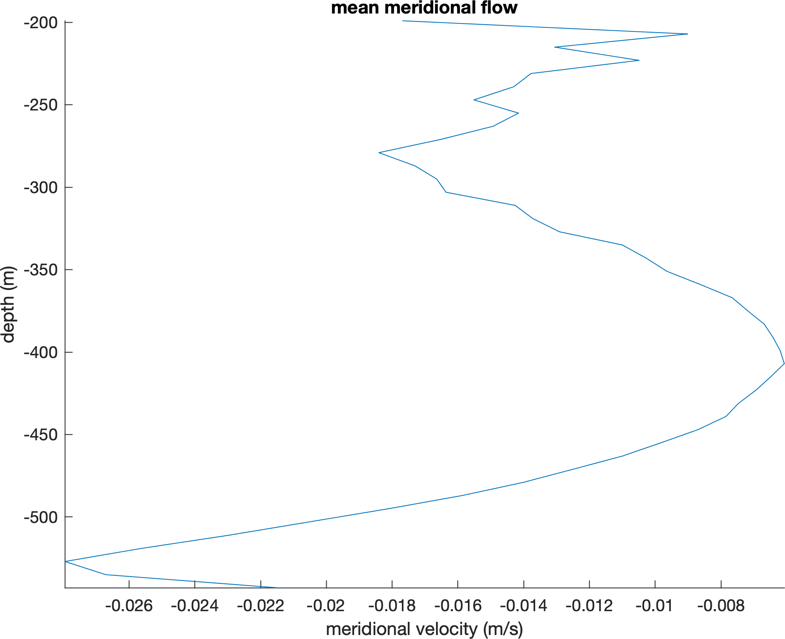

The plot above shows that mean flow is negative (southward, or toward Getz) throughout the entire water column, but is particularly strong near the bottom of the water column. 
 
How much of the mean flow is driven by tides? 

```matlab
>> v_tidal_mean = mean(v_pred)
v_tidal_mean =
   1.5288e-05
```

That tiny value of mean tidal velocity tells us that effectively none of the mean flow here is driven by tidal forcing. Here's the mean meridional tidal velocity plotted as a vertical line, for context: 

```matlab
hold on
xline(v_tidal_mean)
```
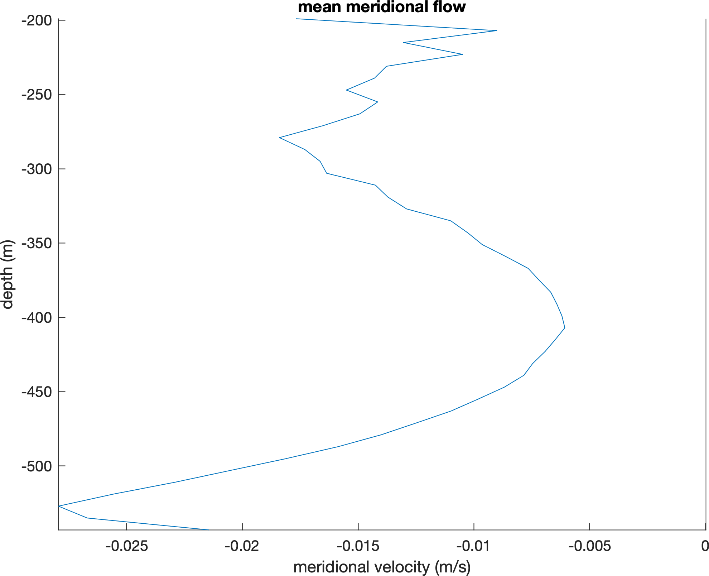

## Water transports versus velocities 
By default, TMD calculates _transport_ variables (m^2/s), then divides them by water column thickness to get barotropic tidal velocity (m/s). If bathymetry in the model is inaccurate, then errors in predicted currents will scale with the bathymetry error. 
 
 In this particular case, we know the depth of the mooring, which is 

```matlab
>> z(1)
ans =
  -543
```

How accurate is the model bathymetry at the location of this mooring?  Entering the model filename `fn` which we defined above, we can get the water column thickness at this location: 

```matlab
>> wct_model = tmd_interp(fn,'wct',lat,lon)
wct_model =
  553.2222
```
Just a few meters off! When you account for potential error in the mooring depth measurement, and the fact that mooring location may not perfectly represent the mean depth of the entire model grid cell, I'd say these two values are just about equal. 
 
If you ever encounter a case where the water column thickness in the model is drastically different from the known wct, I recommend predicting the *transport* (capital U and V), then divide by your known wct. 

## Author Info 
This tutorial was written by Chad A. Greene, June 2022. 